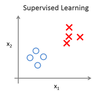

### 1.4 无监督学习

参考视频: 1 - 4 - Unsupervised Learning (14 min).mkv

本次视频中，我们将介绍第二种主要的机器学习问题。叫做无监督学习。

上个视频中，已经介绍了监督学习。回想当时的数据集，如图表所示，这个数据集中每条数据都已经标明是阴性或阳性，即是良性或恶性肿瘤。所以，对于监督学习里的每条数据，我们已经清楚地知道，训练集对应的正确答案，是良性或恶性了。

在无监督学习中，我们已知的数据。看上去有点不一样，不同于监督学习的数据的样子，即无监督学习中没有任何的标签或者是有相同的标签或者就是没标签。所以我们已知数据集，却不知如何处理，也未告知每个数据点是什么。别的都不知道，就是一个数据集。你能从数据中找到某种结构吗？针对数据集，无监督学习就能判断出数据有两个不同的聚集簇。这是一个，那是另一个，二者不同。是的，无监督学习算法可能会把这些数据分成两个不同的簇。所以叫做聚类算法。事实证明，它能被用在很多地方。

聚类应用的一个例子就是在谷歌新闻中。如果你以前从来没见过它，你可以到这个URL网址news.google.com去看看。谷歌新闻每天都在，收集非常多，非常多的网络的新闻内容。它再将这些新闻分组，组成有关联的新闻。所以谷歌新闻做的就是搜索非常多的新闻事件，自动地把它们聚类到一起。所以，这些新闻事件全是同一主题的，所以显示到一起。

事实证明，聚类算法和无监督学习算法同样还用在很多其它的问题上。

其中就有基因学的理解应用。一个**DNA**微观数据的例子。基本思想是输入一组不同个体，对其中的每个个体，你要分析出它们是否有一个特定的基因。技术上，你要分析多少特定基因已经表达。所以这些颜色，红，绿，灰等等颜色，这些颜色展示了相应的程度，即不同的个体是否有着一个特定的基因。你能做的就是运行一个聚类算法，把个体聚类到不同的类或不同类型的组（人）……

所以这个就是无监督学习，因为我们没有提前告知算法一些信息，比如，这是第一类的人，那些是第二类的人，还有第三类，等等。我们只是说，是的，这是有一堆数据。我不知道数据里面有什么。我不知道谁是什么类型。我甚至不知道人们有哪些不同的类型，这些类型又是什么。但你能自动地找到数据中的结构吗？就是说你要自动地聚类那些个体到各个类，我没法提前知道哪些是哪些。因为我们没有给算法正确答案来回应数据集中的数据，所以这就是无监督学习。

无监督学习或聚集有着大量的应用。它用于组织大型计算机集群。我有些朋友在大数据中心工作，那里有大型的计算机集群，他们想解决什么样的机器易于协同地工作，如果你能够让那些机器协同工作，你就能让你的数据中心工作得更高效。第二种应用就是社交网络的分析。所以已知你朋友的信息，比如你经常发**email**的，或是你**Facebook**的朋友、**谷歌+**圈子的朋友，我们能否自动地给出朋友的分组呢？即每组里的人们彼此都熟识，认识组里的所有人？还有市场分割。许多公司有大型的数据库，存储消费者信息。所以，你能检索这些顾客数据集，自动地发现市场分类，并自动地把顾客划分到不同的细分市场中，你才能自动并更有效地销售或不同的细分市场一起进行销售。这也是无监督学习，因为我们拥有所有的顾客数据，但我们没有提前知道是什么的细分市场，以及分别有哪些我们数据集中的顾客。我们不知道谁是在一号细分市场，谁在二号市场，等等。那我们就必须让算法从数据中发现这一切。最后，无监督学习也可用于天文数据分析，这些聚类算法给出了令人惊讶、有趣、有用的理论，解释了星系是如何诞生的。这些都是聚类的例子，聚类只是无监督学习中的一种。

我现在告诉你们另一种。我先来介绍鸡尾酒宴问题。嗯，你参加过鸡尾酒宴吧？你可以想像下，有个宴会房间里满是人，全部坐着，都在聊天，这么多人同时在聊天，声音彼此重叠，因为每个人都在说话，同一时间都在说话，你几乎听不到你面前那人的声音。所以，可能在一个这样的鸡尾酒宴中的两个人，他俩同时都在说话，假设现在是在个有些小的鸡尾酒宴中。我们放两个麦克风在房间中，因为这些麦克风在两个地方，离说话人的距离不同每个麦克风记录下不同的声音，虽然是同样的两个说话人。听起来像是两份录音被叠加到一起，或是被归结到一起，产生了我们现在的这些录音。另外，这个算法还会区分出两个音频资源，这两个可以合成或合并成之前的录音，实际上，鸡尾酒算法的第一个输出结果是：

1，2，3，4，5，6，7，8，9，10,

所以，已经把英语的声音从录音中分离出来了。

第二个输出是这样：

1，2，3，4，5，6，7，8，9，10。

看看这个无监督学习算法，实现这个得要多么的复杂，是吧？它似乎是这样，为了构建这个应用，完成这个音频处理似乎需要你去写大量的代码或链接到一堆的合成器**JAVA**库，处理音频的库，看上去绝对是个复杂的程序，去完成这个从音频中分离出音频。事实上，这个算法对应你刚才知道的那个问题的算法可以就用一行代码来完成。

就是这里展示的代码：`[W,s,v] = svd((repmat(sum(x.*x,1),size(x,1),1).*x)*x');`

研究人员花费了大量时间才最终实现这行代码。我不是说这个是简单的问题，但它证明了，当你使用正确的编程环境，许多学习算法是相当短的程序。所以，这也是为什么在本课中，我们打算使用**Octave**编程环境。**Octave**,是免费的开源软件，使用一个像**Octave**或**Matlab**的工具，许多学习算法变得只有几行代码就可实现。

后面，我会教你们一点关于如何使用**Octave**的知识，你就可以用**Octave**来实现一些算法了。或者，如果你有**Matlab**（盗版？），你也可以用**Matlab**。事实上，在硅谷里，对大量机器学习算法，我们第一步就是建原型，在**Octave**建软件原型，因为软件在**Octave**中可以令人难以置信地、快速地实现这些学习算法。这里的这些函数比如**SVM**（**支持向量机**）函数，**奇异值分解**，**Octave**里已经建好了。如果你试图完成这个工作，但借助**C++**或**JAVA**的话，你会需要很多很多行的代码，并链接复杂的**C++**或**Java**库。所以，你可以实现这些算法，借助**C++**或**Java**或**Python**，它只是用这些语言来实现会更加复杂。(编者注：这个是当时的情况，现在**Python**变主流了)

我已经见到，在我教机器学习将近十年后的现在，发现，学习可以更加高速，如果使用**Octave**作为编程环境，如果使用**Octave**作为学习工具，以及作为原型工具，它会让你对学习算法的学习和建原型快上许多。

事实上，许多人在大硅谷的公司里做的其实就是，使用一种工具像**Octave**来做第一步的学习算法的原型搭建，只有在你已经让它工作后，你才移植它到**C++**或**Java**或别的语言。事实证明，这样做通常可以让你的算法运行得比直接用**C++**实现更快，所以，我知道，作为一名指导者，我必须说“相信我”，但对你们中从未使用过**Octave**这种编程环境的人，我还是要告诉你们这一点一定要相信我，我想，对你们而言，我认为你们的时间，你们的开发时间是最有价值的资源。我已经见过很多人这样做了，我把你看作是机器学习研究员，或机器学习开发人员，想更加高产的话，你要学会使用这个原型工具，开始使用**Octave**。

最后，总结下本视频内容，我有个简短的复习题给你们。

我们介绍了无监督学习，它是学习策略，交给算法大量的数据，并让算法为我们从数据中找出某种结构。

好的，希望你们还记得**垃圾邮件问题**。如果你有标记好的数据，区别好是垃圾还是非垃圾邮件，我们把这个当作**监督学习问题**。

**新闻事件分类**的例子，就是那个谷歌新闻的例子，我们在本视频中有见到了，我们看到，可以用一个聚类算法来聚类这些文章到一起，所以是**无监督学习**。

**细分市场**的例子，我在更早一点的时间讲过，你可以当作**无监督学习**问题，因为我只是拿到算法数据，再让算法去自动地发现细分市场。

最后一个例子，**糖尿病**，这个其实就像是我们的乳腺癌，上个视频里的。只是替换了好、坏肿瘤，良性、恶性肿瘤，我们改用糖尿病或没病。所以我们把这个当作**监督学习**，我们能够解决它，作为一个监督学习问题，就像我们在乳腺癌数据中做的一样。

好了，以上就是无监督学习的视频内容，在下一个视频中，我们将深入探究特定的学习算法，开始介绍这些算法是如何工作的，和我们还有你如何来实现它们。

二、单变量线性回归(Linear Regression with One Variable)
-------------------------------------------------------

