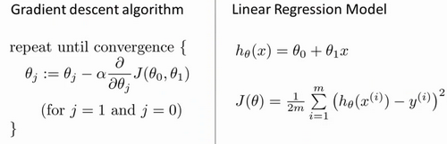

### 2.7 梯度下降的线性回归

参考视频: 2 - 7 - GradientDescentForLinearRegression (6 min).mkv

在以前的视频中我们谈到关于梯度下降算法，梯度下降是很常用的算法，它不仅被用在线性回归上和线性回归模型、平方误差代价函数。在这段视频中，我们要将梯度下降和代价函数结合。我们将用到此算法，并将其应用于具体的拟合直线的线性回归算法里。

梯度下降算法和线性回归算法比较如图：

对我们之前的线性回归问题运用梯度下降法，关键在于求出代价函数的导数，即：

$\frac{\partial }{\partial {{\theta }_{j}}}J({{\theta }_{0}},{{\theta }_{1}})=\frac{\partial }{\partial {{\theta }_{j}}}\frac{1}{2m}{{\sum\limits_{i=1}^{m}{\left( {{h}_{\theta }}({{x}^{(i)}})-{{y}^{(i)}} \right)}}^{2}}$

$j=0$  时：$\frac{\partial }{\partial {{\theta }_{0}}}J({{\theta }_{0}},{{\theta }_{1}})=\frac{1}{m}{{\sum\limits_{i=1}^{m}{\left( {{h}_{\theta }}({{x}^{(i)}})-{{y}^{(i)}} \right)}}}$

$j=1$  时：$\frac{\partial }{\partial {{\theta }_{1}}}J({{\theta }_{0}},{{\theta }_{1}})=\frac{1}{m}\sum\limits_{i=1}^{m}{\left( \left( {{h}_{\theta }}({{x}^{(i)}})-{{y}^{(i)}} \right)\cdot {{x}^{(i)}} \right)}$

则算法改写成：

**Repeat {**

​                ${\theta_{0}}:={\theta_{0}}-a\frac{1}{m}\sum\limits_{i=1}^{m}{ \left({{h}_{\theta }}({{x}^{(i)}})-{{y}^{(i)}} \right)}$

​                ${\theta_{1}}:={\theta_{1}}-a\frac{1}{m}\sum\limits_{i=1}^{m}{\left( \left({{h}_{\theta }}({{x}^{(i)}})-{{y}^{(i)}} \right)\cdot {{x}^{(i)}} \right)}$

​               **}**

我们刚刚使用的算法，有时也称为批量梯度下降。实际上，在机器学习中，通常不太会给算法起名字，但这个名字”**批量梯度下降**”，指的是在梯度下降的每一步中，我们都用到了所有的训练样本，在梯度下降中，在计算微分求导项时，我们需要进行求和运算，所以，在每一个单独的梯度下降中，我们最终都要计算这样一个东西，这个项需要对所有$m$个训练样本求和。因此，批量梯度下降法这个名字说明了我们需要考虑所有这一"批"训练样本，而事实上，有时也有其他类型的梯度下降法，不是这种"批量"型的，不考虑整个的训练集，而是每次只关注训练集中的一些小的子集。在后面的课程中，我们也将介绍这些方法。

但就目前而言，应用刚刚学到的算法，你应该已经掌握了批量梯度算法，并且能把它应用到线性回归中了，这就是用于线性回归的梯度下降法。

如果你之前学过线性代数，有些同学之前可能已经学过高等线性代数，你应该知道有一种计算代价函数$J$最小值的数值解法，不需要梯度下降这种迭代算法。在后面的课程中，我们也会谈到这个方法，它可以在不需要多步梯度下降的情况下，也能解出代价函数$J$的最小值，这是另一种称为正规方程(**normal equations**)的方法。实际上在数据量较大的情况下，梯度下降法比正规方程要更适用一些。

现在我们已经掌握了梯度下降，我们可以在不同的环境中使用梯度下降法，我们还将在不同的机器学习问题中大量地使用它。所以，祝贺大家成功学会你的第一个机器学习算法。

在下一段视频中，告诉你泛化的梯度下降算法，这将使梯度下降更加强大。

