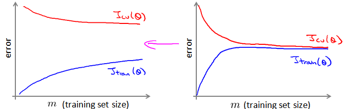

### 17.1 大型数据集的学习

参考视频: 17 - 1 - Learning With Large Datasets (6 min).mkv

如果我们有一个低方差的模型，增加数据集的规模可以帮助你获得更好的结果。我们应该怎样应对一个有100万条记录的训练集？

以线性回归模型为例，每一次梯度下降迭代，我们都需要计算训练集的误差的平方和，如果我们的学习算法需要有20次迭代，这便已经是非常大的计算代价。

首先应该做的事是去检查一个这么大规模的训练集是否真的必要，也许我们只用1000个训练集也能获得较好的效果，我们可以绘制学习曲线来帮助判断。

