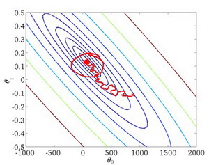

### 17.4 随机梯度下降收敛

参考视频: 17 - 4 - Stochastic Gradient Descent Convergence (12 min). mkv

现在我们介绍随机梯度下降算法的调试，以及学习率 $α$ 的选取。

在批量梯度下降中，我们可以令代价函数$J$为迭代次数的函数，绘制图表，根据图表来判断梯度下降是否收敛。但是，在大规模的训练集的情况下，这是不现实的，因为计算代价太大了。

在随机梯度下降中，我们在每一次更新 ${{\theta }}$ 之前都计算一次代价，然后每$x$次迭代后，求出这$x$次对训练实例计算代价的平均值，然后绘制这些平均值与$x$次迭代的次数之间的函数图表。

当我们绘制这样的图表时，可能会得到一个颠簸不平但是不会明显减少的函数图像（如上面左下图中蓝线所示）。我们可以增加$α$来使得函数更加平缓，也许便能看出下降的趋势了（如上面左下图中红线所示）；或者可能函数图表仍然是颠簸不平且不下降的（如洋红色线所示），那么我们的模型本身可能存在一些错误。

如果我们得到的曲线如上面右下方所示，不断地上升，那么我们可能会需要选择一个较小的学习率$α$。

我们也可以令学习率随着迭代次数的增加而减小，例如令：

​							$$\alpha = \frac{const1}{iterationNumber + const2}$$

随着我们不断地靠近全局最小值，通过减小学习率，我们迫使算法收敛而非在最小值附近徘徊。
但是通常我们不需要这样做便能有非常好的效果了，对$α$进行调整所耗费的计算通常不值得

总结下，这段视频中，我们介绍了一种方法，近似地监测出随机梯度下降算法在最优化代价函数中的表现，这种方法不需要定时地扫描整个训练集，来算出整个样本集的代价函数，而是只需要每次对最后1000个，或者多少个样本，求一下平均值。应用这种方法，你既可以保证随机梯度下降法正在正常运转和收敛，也可以用它来调整学习速率$α$的大小。

