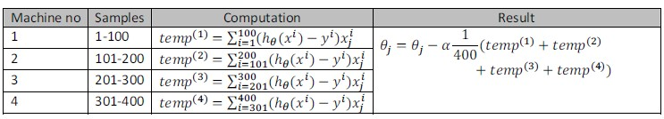

### 17.6 映射化简和数据并行

参考视频: 17 - 6 - Map Reduce and Data Parallelism (14 min).mkv

映射化简和数据并行对于大规模机器学习问题而言是非常重要的概念。之前提到，如果我们用批量梯度下降算法来求解大规模数据集的最优解，我们需要对整个训练集进行循环，计算偏导数和代价，再求和，计算代价非常大。如果我们能够将我们的数据集分配给不多台计算机，让每一台计算机处理数据集的一个子集，然后我们将计所的结果汇总在求和。这样的方法叫做映射简化。

具体而言，如果任何学习算法能够表达为，对训练集的函数的求和，那么便能将这个任务分配给多台计算机（或者同一台计算机的不同**CPU** 核心），以达到加速处理的目的。

例如，我们有400个训练实例，我们可以将批量梯度下降的求和任务分配给4台计算机进行处理：

           

很多高级的线性代数函数库已经能够利用多核**CPU**的多个核心来并行地处理矩阵运算，这也是算法的向量化实现如此重要的缘故（比调用循环快）。

