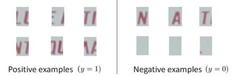
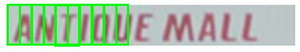

### 18.2 滑动窗口

参考视频: 18 - 2 - Sliding Windows (15 min).mkv

滑动窗口是一项用来从图像中抽取对象的技术。假使我们需要在一张图片中识别行人，首先要做的是用许多固定尺寸的图片来训练一个能够准确识别行人的模型。然后我们用之前训练识别行人的模型时所采用的图片尺寸在我们要进行行人识别的图片上进行剪裁，然后将剪裁得到的切片交给模型，让模型判断是否为行人，然后在图片上滑动剪裁区域重新进行剪裁，将新剪裁的切片也交给模型进行判断，如此循环直至将图片全部检测完。

一旦完成后，我们按比例放大剪裁的区域，再以新的尺寸对图片进行剪裁，将新剪裁的切片按比例缩小至模型所采纳的尺寸，交给模型进行判断，如此循环。

滑动窗口技术也被用于文字识别，首先训练模型能够区分字符与非字符，然后，运用滑动窗口技术识别字符，一旦完成了字符的识别，我们将识别得出的区域进行一些扩展，然后将重叠的区域进行合并。接着我们以宽高比作为过滤条件，过滤掉高度比宽度更大的区域（认为单词的长度通常比高度要大）。下图中绿色的区域是经过这些步骤后被认为是文字的区域，而红色的区域是被忽略的。

以上便是文字侦测阶段。
下一步是训练一个模型来完成将文字分割成一个个字符的任务，需要的训练集由单个字符的图片和两个相连字符之间的图片来训练模型。

模型训练完后，我们仍然是使用滑动窗口技术来进行字符识别。

以上便是字符切分阶段。
最后一个阶段是字符分类阶段，利用神经网络、支持向量机或者逻辑回归算法训练一个分类器即可。

