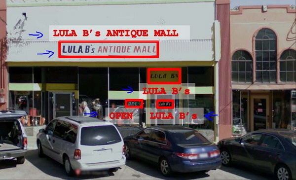

### 18.1 问题描述和流程图

参考视频: 18 - 1 - Problem Description and Pipeline (7 min).mkv

图像文字识别应用所作的事是，从一张给定的图片中识别文字。这比从一份扫描文档中识别文字要复杂的多。

为了完成这样的工作，需要采取如下步骤：

1. 文字侦测（**Text detection**）——将图片上的文字与其他环境对象分离开来

2. 字符切分（**Character segmentation**）——将文字分割成一个个单一的字符

3. 字符分类（**Character classification**）——确定每一个字符是什么
  可以用任务流程图来表达这个问题，每一项任务可以由一个单独的小队来负责解决：

