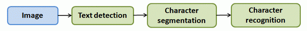

### 18.4 上限分析：哪部分管道的接下去做

参考视频: 18 - 4 - Ceiling Analysis\_ What Part of the Pipeline to Work on Next
(14 min).mkv

在机器学习的应用中，我们通常需要通过几个步骤才能进行最终的预测，我们如何能够知道哪一部分最值得我们花时间和精力去改善呢？这个问题可以通过上限分析来回答。

回到我们的文字识别应用中，我们的流程图如下：

流程图中每一部分的输出都是下一部分的输入，上限分析中，我们选取一部分，手工提供100%正确的输出结果，然后看应用的整体效果提升了多少。假使我们的例子中总体效果为72%的正确率。

如果我们令文字侦测部分输出的结果100%正确，发现系统的总体效果从72%提高到了89%。这意味着我们很可能会希望投入时间精力来提高我们的文字侦测部分。

接着我们手动选择数据，让字符切分输出的结果100%正确，发现系统的总体效果只提升了1%，这意味着，我们的字符切分部分可能已经足够好了。

最后我们手工选择数据，让字符分类输出的结果100%正确，系统的总体效果又提升了10%，这意味着我们可能也会应该投入更多的时间和精力来提高应用的总体表现。

