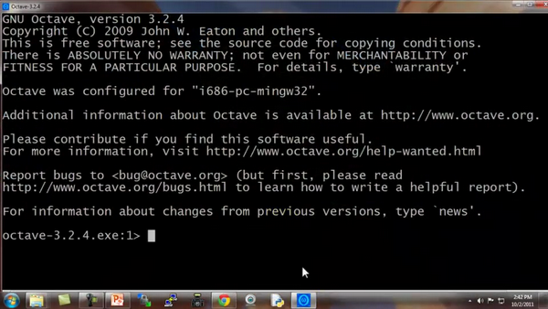
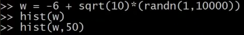

### 5.1 基本操作

参考视频: 5 - 1 - Basic Operations (14 min).mkv

在这段视频中，我将教你一种编程语言：**Octave**语言。你能够用它来非常迅速地实现这门课中我们已经学过的，或者将要学的机器学习算法。

过去我一直尝试用不同的编程语言来教授机器学习，包括**C++**、**Java**、**Python**、**Numpy**和**Octave**。我发现当使用像**Octave**这样的高级语言时，学生能够更快更好地学习并掌握这些算法。事实上，在硅谷，我经常看到进行大规模的机器学习项目的人，通常使用的程序语言就是**Octave**。(编者注：这是当时的情况，现在主要是用**Python**)

**Octave**是一种很好的原始语言(**prototyping language**)，使用**Octave**你能快速地实现你的算法，剩下的事情，你只需要进行大规模的资源配置，你只用再花时间用**C++**或**Java**这些语言把算法重新实现就行了。开发项目的时间是很宝贵的，机器学习的时间也是很宝贵的。所以，如果你能让你的学习算法在**Octave**上快速的实现，基本的想法实现以后，再用**C++**或者**Java**去改写，这样你就能节省出大量的时间。

据我所见，人们使用最多的用于机器学习的原始语言是**Octave**、**MATLAB**、**Python**、**NumPy** 和**R**。

**Octave**很好，因为它是开源的。当然**MATLAB**也很好，但它不是每个人都买得起的。(貌似国内学生喜欢用收费的**matlab**，**matlab**功能要比**Octave**强大的多，网上有各种**D**版可以下载)。这次机器学习课的作业也是用**matlab**的。如果你能够使用**matlab**，你也可以在这门课里面使用。

如果你会**Python**、**NumPy**或者**R**语言，我也见过有人用 **R**的，据我所知，这些人不得不中途放弃了，因为这些语言在开发上比较慢，而且，因为这些语言如：**Python**、**NumPy**的语法相较于**Octave**来说，还是更麻烦一点。正因为这样，所以我强烈建议不要用**NumPy**或者**R**来完整这门课的作业，我建议在这门课中用**Octave**来写程序。

本视频将快速地介绍一系列的命令，目标是迅速地展示，通过这一系列**Octave**的命令，让你知道**Octave**能用来做什么。

启动**Octave**：

现在打开**Octave**，这是**Octave**命令行。



现在让我示范最基本的**Octave**代码：

输入5 + 6，然后得到11。

输入3 – 2、5×8、1/2、2^6等等，得到相应答案。


这些都是基本的数学运算。


你也可以做逻辑运算，例如 1==2，计算结果为 **false** (**假**)，这里的百分号命令表示注释，1==2 计算结果为假，这里用0表示。

请注意，不等于符号的写法是这个波浪线加上等于符号 ( \~= )，而不是等于感叹号加等号( != )，这是和其他一些编程语言中不太一样的地方。


让我们看看逻辑运算 1 && 0，使用双&符号表示逻辑与，1 && 0判断为假，1和0的或运算 1 \|\| 0，其计算结果为真。


还有异或运算 如`XOR ( 1, 0 )`，其返回值为1

从左向右写着 **Octave 324.x**版本，是默认的**Octave**提示，它显示了当前**Octave**的版本，以及相关的其它信息。

如果你不想看到那个提示，这里有一个隐藏的命令：

输入命令


现在命令提示已经变得简化了。

接下来，我们将谈到**Octave**的变量。

现在写一个变量，对变量$A$赋值为3，并按下回车键，显示变量$A$等于3。


如果你想分配一个变量，但不希望在屏幕上显示结果，你可以在命令后加一个分号，可以抑制打印输出，敲入回车后，不打印任何东西。


其中这句命令不打印任何东西。

现在举一个字符串的例子：变量$b$等于"**hi**"。


$c$等于3大于等于1，所以，现在$c$变量的值是真。


如果你想打印出变量，或显示一个变量，你可以像下面这么做：

设置$a$等于圆周率$π$，如果我要打印该值，那么只需键入`a`像这样 就打印出来了。


对于更复杂的屏幕输出，也可以用**DISP**命令显示：


这是一种，旧风格的**C语言**语法，对于之前就学过**C语言**的同学来说，你可以使用这种基本的语法来将结果打印到屏幕。

例如 ^{T}命令的六个小数：0.6%f ,a，这应该打印$π$的6位小数形式。

也有一些控制输出长短格式的快捷命令：


下面，让我们来看看向量和矩阵：

比方说 建立一个矩阵$A$：


对$A$矩阵进行赋值，考虑到这是一个三行两列的矩阵，你同样可以用向量。

建立向量$V$并赋值1 2 3，$V$是一个行向量，或者说是一个3 ( 列 )×1 ( 行 )的向量，或者说，一行三列的矩阵。

如果我想，分配一个列向量，我可以写“1;2;3”，现在便有了一个3 行 1 列的向量，同时这是一个列向量。

下面是一些更为有用的符号，如：

```matlab
V=1：0.1：2
```

这个该如何理解呢：这个集合$v$是一组值，从数值1开始，增量或说是步长为0.1，直到增加到2，按照这样的方法对向量$V$操作，可以得到一个行向量，这是一个1行11列的矩阵，其矩阵的元素是1
1.1 1.2 1.3，依此类推，直到数值2。

我也可以建立一个集合$v$并用命令“1:6”进行赋值，这样$V$就被赋值了1至6的六个整数。


这里还有一些其他的方法来生成矩阵

例如“`ones(2, 3)`”，也可以用来生成矩阵：


元素都为2，两行三列的矩阵，就可以使用这个命令：


你可以把这个方法当成一个生成矩阵的快速方法。

$w$为一个一行三列的零矩阵，一行三列的$A$矩阵里的元素全部是零：


还有很多的方式来生成矩阵。

如果我对$W$进行赋值，用**Rand**命令建立一个一行三列的矩阵，因为使用了**Rand**命令，则其一行三列的元素均为随机值，如“`rand(3,3)`”命令，这就生成了一个3×3的矩阵，并且其所有元素均为随机。


数值介于0和1之间，所以，正是因为这一点，我们可以得到数值均匀介于0和1之间的元素。

如果，你知道什么是高斯随机变量，或者，你知道什么是正态分布的随机变量，你可以设置集合$W$，使其等于一个一行三列的$N$矩阵，并且，来自三个值，一个平均值为0的高斯分布，方差或者等于1的标准偏差。


还可以设置地更复杂：

并用**hist**命令绘制直方图。



绘制单位矩阵：


如果对命令不清楚，建议用**help**命令：


以上讲解的内容都是**Octave**的基本操作。希望你能通过上面的讲解，自己练习一些矩阵、乘、加等操作，将这些操作在**Octave**中熟练运用。

在接下来的视频中，将会涉及更多复杂的命令，并使用它们在**Octave**中对数据进行更多的操作。

