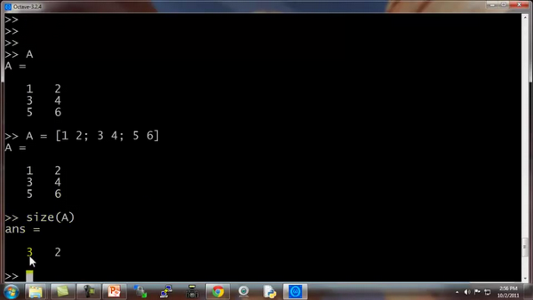
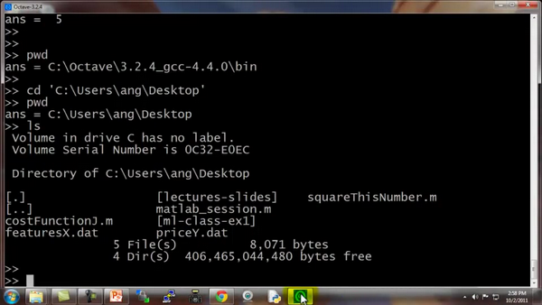
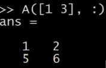
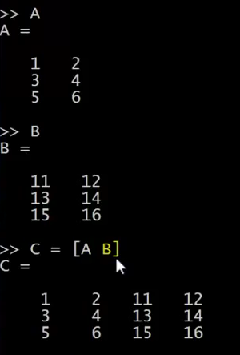
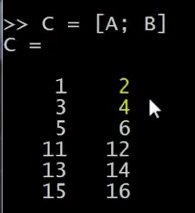

### 5.2 移动数据

参考视频: 5 - 2 - Moving Data Around (16 min).mkv

在这段关于 **Octave**的辅导课视频中，我将开始介绍如何在 **Octave** 中移动数据。

如果你有一个机器学习问题，你怎样把数据加载到 **Octave** 中？

怎样把数据存入一个矩阵？

如何对矩阵进行相乘？

如何保存计算结果？

如何移动这些数据并用数据进行操作？

进入我的 **Octave** 窗口，

我键入$A$，得到我们之前构建的矩阵 $A$，也就是用这个命令生成的：

`A = [1 2; 3 4; 5 6]`

这是一个3行2列的矩阵，**Octave** 中的 `size()` 命令返回矩阵的尺寸。

所以 `size(A)` 命令返回3 2

实际上，`size()` 命令返回的是一个 1×2 的矩阵，我们可以用 $sz$ 来存放。

设置 `sz = size(A)`

因此 $sz$ 就是一个1×2的矩阵，第一个元素是3，第二个元素是2。

所以如果键入 `size(sz)` 看看 $sz$ 的尺寸，返回的是1 2，表示是一个1×2的矩阵，1 和 2分别表示矩阵$sz$的维度 。

你也可以键入 `size(A, 1)`，将返回3，这个命令会返回$A$矩阵的第一个元素，$A$矩阵的第一个维度的尺寸，也就是 $A$ 矩阵的行数。

同样，命令 `size(A, 2)`，将返回2，也就是 $A$ 矩阵的列数。

如果你有一个向量 $v$，假如 `v = [1 2 3 4]`，然后键入`length(v)`，这个命令将返回最大维度的大小，返回4。

你也可以键入`length(A)`，由于矩阵$A$是一个3×2的矩阵，因此最大的维度应该是3，因此该命令会返回3。

但通常我们还是对向量使用 $length$ 命令，而不是对矩阵使用 `length` 命令，比如
`length([1;2;3;4;5])`，返回5。

如何在系统中加载数据和寻找数据：

当我们打开 **Octave** 时，我们通常已经在一个默认路径中，这个路径是 **Octave**的安装位置，`pwd` 命令可以显示出**Octave** 当前所处路径。

`cd`命令，意思是改变路径，我可以把路径改为**C:\\Users\\ang\\Desktop**，这样当前目录就变为了桌面。

如果键入 `ls`，**ls** 来自于一个 **Unix** 或者 **Linux** 命令，**ls**命令将列出我桌面上的所有路径。

事实上，我的桌面上有两个文件：**featuresX.dat** 和**priceY.dat**，是两个我想解决的机器学习问题。

**featuresX**文件如这个窗口所示，是一个含有两列数据的文件，其实就是我的房屋价格数据，数据集中有47行，第一个房子样本，面积是2104平方英尺，有3个卧室，第二套房子面积为1600，有3个卧室等等。

**priceY**这个文件就是训练集中的价格数据，所以 **featuresX** 和**priceY**就是两个存放数据的文档，那么应该怎样把数据读入 **Octave** 呢？我们只需要键入`featuresX.dat`，这样我将加载了 **featuresX** 文件。同样地我可以加载`priceY.dat`。其实有好多种办法可以完成，如果你把命令写成字符串的形式`load('featureX.dat')`，也是可以的，这跟刚才的命令效果是相同的，只不过是把文件名写成了一个字符串的形式，现在文件名被存在一个字符串中。**Octave**中使用引号来表示字符串。

另外 `who` 命令，能显示出 在我的 **Octave**工作空间中的所有变量

所以我可以键入`featuresX` 回车，来显示 **featuresX**

这些就是存在里面的数据。

还可以键入 `size(featuresX)`，得出的结果是 47 2，代表这是一个47×2的矩阵。

类似地，输入 `size(priceY)`，结果是 47
1，表示这是一个47维的向量，是一个列矩阵，存放的是训练集中的所有价格$Y$ 的值。

`who` 函数能让你看到当前工作空间中的所有变量，同样还有另一个 `whos`命令，能更详细地进行查看。

同样也列出我所有的变量，不仅如此，还列出了变量的维度。

**double** 意思是双精度浮点型，这也就是说，这些数都是实数，是浮点数。

如果你想删除某个变量，你可以使用 `clear` 命令，我们键入 `clear featuresX`，然后再输入 `whos` 命令，你会发现 **featuresX** 消失了。

另外，我们怎么储存数据呢？

我们设变量 `V= priceY(1:10)`

这表示的是将向量 $Y $的前10个元素存入 $V$中。

假如我们想把它存入硬盘，那么用 `save hello.mat v` 命令，这个命令会将变量$V$存成一个叫 **hello.mat** 的文件，让我们回车，现在我的桌面上就出现了一个新文件，名为**hello.mat**。

由于我的电脑里同时安装了 **MATLAB**，所以这个图标上面有 **MATLAB**的标识，因为操作系统把文件识别为 **MATLAB**文件。如果在你的电脑上图标显示的不一样的话，也没有关系。

现在我们清除所有变量，直接键入`clear`，这样将删除工作空间中的所有变量，所以现在工作空间中啥都没了。

但如果我载入 **hello.mat** 文件，我又重新读取了变量 $v$，因为我之前把变量$v$存入了**hello.mat** 文件中，所以我们刚才用 `save`命令做了什么。这个命令把数据按照二进制形式储存，或者说是更压缩的二进制形式，因此，如果$v$是很大的数据，那么压缩幅度也更大，占用空间也更小。如果你想把数据存成一个人能看懂的形式，那么可以键入：

`save hello.txt v -ascii`

这样就会把数据存成一个文本文档，或者将数据的 **ascii 码**存成文本文档。

我键入了这个命令以后，我的桌面上就有了 **hello.txt**文件。如果打开它，我们可以发现这个文本文档存放着我们的数据。

这就是读取和储存数据的方法。

接下来我们再来讲讲操作数据的方法：

假如 $A$ 还是那个矩阵

跟刚才一样还是那个 3×2 的矩阵，现在我们加上索引值，比如键入 `A(3,2)`

这将索引到$A$ 矩阵的 (3,2) 元素。这就是我们通常书写矩阵的形式，写成 $A$ 32，3和2分别表示矩阵的第三行和第二列对应的元素，因此也就对应 6。

我也可以键入`A(2,:)` 来返回第二行的所有元素，冒号表示该行或该列的所有元素。

类似地，如果我键入 `A(:,2)`，这将返回 $A$ 矩阵第二列的所有元素，这将得到 2 4 6。

这表示返回$A$ 矩阵的第二列的所有元素。

你也可以在运算中使用这些较为复杂的索引。

我再给你展示几个例子，可能你也不会经常使用，但我还是输入给你看 `A([1 3],:)`，这个命令意思是取 $A$ 矩阵第一个索引值为1或3的元素，也就是说我取的是A矩阵的第一行和第三行的每一列，冒号表示的是取这两行的每一列元素，即：

可能这些比较复杂一点的索引操作你会经常用到。

我们还能做什么呢？依然是 $A$ 矩阵，`A(:,2)` 命令返回第二列。

你也可以为它赋值，我可以取 $A$ 矩阵的第二列，然后将它赋值为10 11 12，我实际上是取出了 $A$ 的第二列，然后把一个列向量[10;11;12]赋给了它，因此现在 $A$ 矩阵的第一列还是 1 3 5，第二列就被替换为 10 11 12。

接下来一个操作，让我们把 $A $设为`A = [A, [100, 101,102]]`，这样做的结果是在原矩阵的右边附加了一个新的列矩阵，就是把 $A$矩阵设置为原来的 $A$ 矩阵再在右边附上一个新添加的列矩阵。

最后，还有一个小技巧，如果你就输入 `A(:)`，这是一个很特别的语法结构，意思是把 $A$中的所有元素放入一个单独的列向量，这样我们就得到了一个 9×1 的向量，这些元素都是$A$ 中的元素排列起来的。

再来几个例子：

我还是把 A 重新设为 [1 2; 3 4; 5 6]，我再设一个 $B$为[11 12; 13 14; 15 16]，我可以新建一个矩阵 $C$，`C = [A B]`，这个意思就是把这两个矩阵直接连在一起，矩阵$A$ 在左边，矩阵$B$ 在右边，这样组成了 $C$矩阵，就是直接把$A$和 $B$ 合起来。

我还可以设`C = [A; B]`，这里的分号表示把分号后面的东西放到下面。所以，`[A;B]`的作用依然还是把两个矩阵放在一起，只不过现在是上下排列，所以现在 $A$ 在上面 $B$在下面，$C$ 就是一个 6×2 矩阵。

简单地说，分号的意思就是换到下一行，所以 C 就包括上面的A，然后换行到下面，然后在下面放上一个 $B$。

另外顺便说一下，这个`[A B]`命令跟 `[A, B]` 是一样的，这两种写法的结果是相同的。

通过以上这些操作，希望你现在掌握了怎样构建矩阵，也希望我展示的这些命令能让你很快地学会怎样把矩阵放到一起，怎样取出矩阵，并且把它们放到一起，组成更大的矩阵。

通过几句简单的代码，**Octave**能够很方便地很快速地帮助我们组合复杂的矩阵以及对数据进行移动。这就是移动数据这一节课。

我认为对你来讲，最好的学习方法是，下课后复习一下我键入的这些代码好好地看一看，从课程的网上把代码的副本下载下来，重新好好看看这些副本，然后自己在**Octave** 中把这些命令重新输一遍，慢慢开始学会使用这些命令。

当然，没有必要把这些命令都记住，你也不可能记得住。你要做的就是，了解一下你可以用哪些命令，做哪些事。这样在你今后需要编写学习算法时，如果你要找到某个**Octave**中的命令，你可能回想起你之前在这里学到过，然后你就可以查找课程中提供的程序副本，这样就能很轻松地找到你想使用的命令了。

