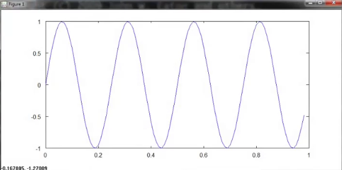
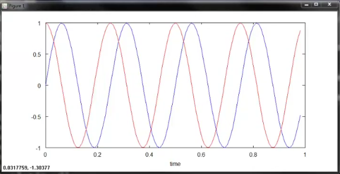
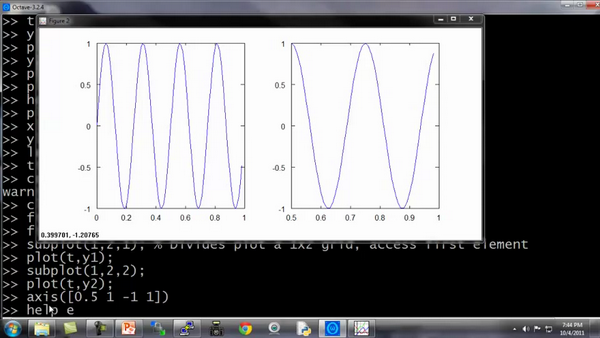
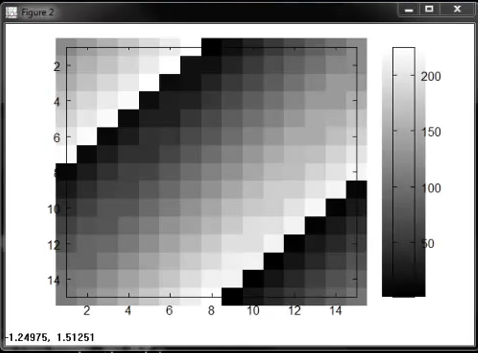
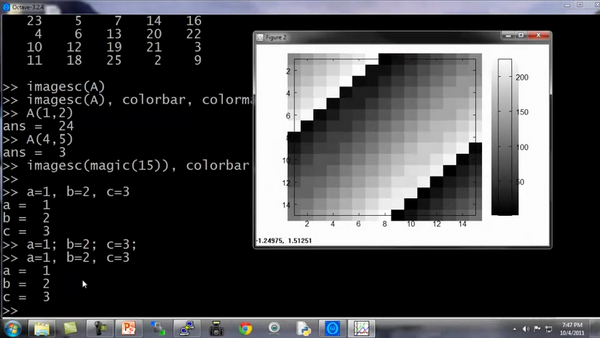

### 5.4 绘图数据

参考视频: 5 - 4 - Plotting Data (10 min).mkv

当开发学习算法时，往往几个简单的图，可以让你更好地理解算法的内容，并且可以完整地检查下算法是否正常运行，是否达到了算法的目的。

例如在之前的视频中，我谈到了绘制成本函数$J(\theta)$，可以帮助确认梯度下降算法是否收敛。通常情况下，绘制数据或学习算法所有输出，也会启发你如何改进你的学习算法。幸运的是，**Octave**有非常简单的工具用来生成大量不同的图。当我用学习算法时，我发现绘制数据、绘制学习算法等，往往是我获得想法来改进算法的重要部分。在这段视频中，我想告诉你一些**Octave**的工具来绘制和可视化你的数据。

我们先来快速生成一些数据用来绘图。

如果我想绘制正弦函数，这是很容易的，我只需要输入`plot(t,y1)`，并回车，就出现了这个图：

横轴是$t$变量，纵轴是$y1$，也就是我们刚刚所输出的正弦函数。

让我们设置$y2$

**Octave**将会消除之前的正弦图，并且用这个余弦图来代替它，这里纵轴$cos(x)$从1开始，

如果我要同时表示正弦和余弦曲线。

我要做的就是，输入：`plot(t, y1)`，得到正弦函数，我使用函数**hold on**，**hold on**函数的功能是将新的图像绘制在旧的之上。

我现在绘制$y2$，输入：`plot(t, y2)`。

我要以不同的颜色绘制余弦函数，所以我在这里输入带引号的r绘制余弦函数，$r$表示所使用的颜色：`plot(t,y2,’r’)`，再加上命令`xlabel('time')`，
来标记X轴即水平轴，输入`ylabel('value')`，来标记垂直轴的值。

同时我也可以来标记我的两条函数曲线，用这个命令 `legend('sin','cos')`将这个图例放在右上方，表示这两条曲线表示的内容。最后输入`title('myplot')`，在图像的顶部显示这幅图的标题。

如果你想保存这幅图像，你输入`print –dpng 'myplot.png'`，**png**是一个图像文件格式，如果你这样做了，它可以让你保存为一个文件。

**Octave**也可以保存为很多其他的格式，你可以键入`help plot`。

最后如果你想，删掉这个图像，用命令**close**会让这个图像关掉。

**Octave**也可以让你为图像标号

你键入`figure(1); plot(t, y1);`将显示第一张图，绘制了变量$t$ $y1$。

键入`figure(2); plot(t, y2);` 将显示第一张图，绘制了变量$t$ $y2$。

**subplot**命令，我们要使用`subplot(1,2,1)`，它将图像分为一个1\*2的格子，也就是前两个参数，然后它使用第一个格子，也就是最后一个参数1的意思。

我现在使用第一个格子，如果键入`plot(t,y1)`，现在这个图显示在第一个格子。如果我键入`subplot(1,2,2)`，那么我就要使用第二个格子，键入`plot(t,y2)`；现在y2显示在右边，也就是第二个格子。

最后一个命令，你可以改变轴的刻度，比如改成[0.5 1 -1 1]，输入命令：`axis([0.5 1 -1 1])`也就是设置了右边图的$x$轴和$y$轴的范围。具体而言，它将右图中的横轴的范围调整至0.5到1，竖轴的范围为-1到1。

你不需要记住所有这些命令，如果你需要改变坐标轴，或者需要知道**axis**命令，你可以用**Octave**中用**help**命令了解细节。

最后，还有几个命令。

`Clf`（清除一幅图像）。

让我们设置A等于一个5×5的**magic**方阵：

我有时用一个巧妙的方法来可视化矩阵，也就是`imagesc(A`)命令，它将会绘制一个5\*5的矩阵，一个5\*5的彩色格图，不同的颜色对应A矩阵中的不同值。

我还可以使用函数**colorbar**，让我用一个更复杂的命令 `imagesc(A)，colorbar，colormap gray`。这实际上是在同一时间运行三个命令：运行`imagesc`，然后运行，`colorbar`，然后运行`colormap gray`。

它生成了一个颜色图像，一个灰度分布图，并在右边也加入一个颜色条。所以这个颜色条显示不同深浅的颜色所对应的值。

你可以看到在不同的方格，它对应于一个不同的灰度。

输入`imagesc(magic(15))，colorbar，colormap gray`

这将会是一幅15\*15的**magic**方阵值的图。

最后，总结一下这段视频。你看到我所做的是使用逗号连接函数调用。如果我键入$a=1$,$b=2$,$c=3$然后按**Enter**键，其实这是将这三个命令同时执行，或者是将三个命令一个接一个执行，它将输出所有这三个结果。

这很像$a=1$; $b=2$;$c=3$;如果我用分号来代替逗号，则没有输出出任何东西。

这里我们称之为逗号连接的命令或函数调用。

用逗号连接是另一种**Octave**中更便捷的方式，将多条命令例如`imagesc colorbar colormap`，将这多条命令写在同一行中。

现在你知道如何绘制**Octave**中不同的图像，在下面的视频中，我将告诉你怎样在Octave中，写控制语句，比如**if while for**语句，并且定义和使用函数。

