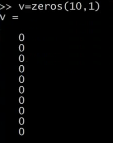
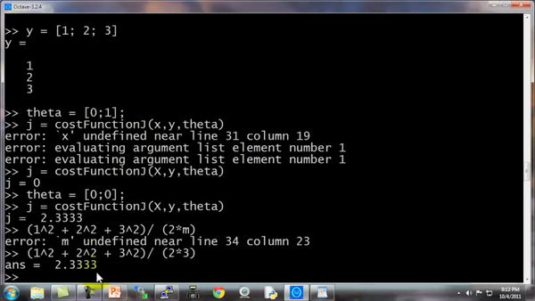

### 5.5 控制语句：for，while，if语句

参考视频: 5 - 5 - Control Statements\_ for, while, if statements (13 min).mkv

在这段视频中，我想告诉你怎样为你的 **Octave** 程序写控制语句。诸如："**for**" "**while**" "**if**" 这些语句，并且如何定义和使用方程。

我先告诉你如何使用 “**for**” 循环。

首先，我要将 $v$ 值设为一个10行1列的零向量。

接着我要写一个 “**for**" 循环，让 $i$ 等于 1 到 10，写出来就是 `i = 1:10`。我要设$ v(i)$的值等于 2 的 $i$ 次方，循环最后写上“**end**”。

向量$v$ 的值就是这样一个集合 2的一次方、2的二次方，依此类推。这就是我的 $i$ 等于 1 到 10的语句结构，让 $i$ 遍历 1 到 10的值。

另外，你还可以通过设置你的 indices (索引) 等于 1一直到10，来做到这一点。这时**indices** 就是一个从1到10的序列。

你也可以写 `i = indices`，这实际上和我直接把 i 写到 1 到 10 是一样。你可以写 `disp(i)`，也能得到一样的结果。所以 这就是一个 “**for**” 循环。

如果你对 “**break**” 和 “**continue**” 语句比较熟悉，**Octave**里也有 “**break**” 和 “**continue**”语句，你也可以在 **Octave**环境里使用那些循环语句。

但是首先让我告诉你一个 **while** 循环是如何工作的：

这是什么意思呢：我让 $i$ 取值从 1 开始，然后我要让 $v(i)$ 等于 100，再让 $i$ 递增 1，直到$i$ 大于 5停止。

现在来看一下结果，我现在已经取出了向量的前五个元素，把他们用100覆盖掉，这就是一个**while**循环的句法结构。

现在我们来分析另外一个例子：

这里我将向你展示如何使用**break**语句。比方说 `v(i) = 999`，然后让 `i = i+1`，当 $i$ 等于6的时候 **break** (停止循环)，结束 (**end**)。

当然这也是我们第一次使用一个 **if** 语句，所以我希望你们可以理解这个逻辑，让 $i$ 等于1 然后开始下面的增量循环，**while**语句重复设置 $v(i)$ 等于999，不断让$i$增加，然后当 $i$ 达到6，做一个中止循环的命令，尽管有**while**循环，语句也就此中止。所以最后的结果是取出向量 $v$ 的前5个元素，并且把它们设置为999。

所以，这就是**if** 语句和 **while** 语句的句法结构。并且要注意要有**end**，上面的例子里第一个 **end** 结束的是 **if**
语句，第二个 **end** 结束的是 **while** 语句。

现在让我告诉你使用 **if-else** 语句：

最后，提醒一件事：如果你需要退出 **Octave**，你可以键入`exit`命令然后回车就会退出 **Octave**，或者命令`quit`也可以。

最后，让我们来说说函数 (**functions**)，如何定义和调用函数。

我在桌面上存了一个预先定义的文件名为 “**squarethisnumber.m**”，这就是在 **Octave** 环境下定义的函数。

让我们打开这个文件。请注意，我使用的是微软的写字板程序来打开这个文件，我只是想建议你，如果你也使用微软的**Windows**系统，那么可以使用写字板程序，而不是记事本来打开这些文件。如果你有别的什么文本编辑器也可以，记事本有时会把代码的间距弄得很乱。如果你只有记事本程序，那也能用。我建议你用写字板或者其他可以编辑函数的文本编辑器。

现在我们来说如何在 **Octave** 里定义函数：

这个文件只有三行：

第一行写着 `function y = squareThisNumber(x)`，这就告诉 **Octave**，我想返回一个 y值，我想返回一个值，并且返回的这个值将被存放于变量 $y$ 里。另外，它告诉了**Octave**这个函数有一个参数，就是参数 $x$，还有定义的函数体，也就是 $y$ 等于 $x$ 的平方。

还有一种更高级的功能，这只是对那些知道“**search path** (**搜索路径**)”这个术语的人使用的。所以如果你想要修改
**Octave**的搜索路径，你可以把下面这部分作为一个进阶知识，或者选学材料，仅适用于那些熟悉编程语言中搜索路径概念的同学。

你可以使用**addpath** 命令添加路径，添加路径“**C:\\Users\\ang\\desktop**”将该目录添加到**Octav**e的搜索路径，这样即使你跑到其他路径底下，**Octave**依然知道会在 **Users\\ang\\desktop**目录下寻找函数。这样，即使我现在在不同的目录下，它仍然知道在哪里可以找到“**SquareThisNumber**” 这个函数。

但是，如果你不熟悉搜索路径的概念，不用担心，只要确保在执行函数之前，先用 `cd`命令设置到你函数所在的目录下，实际上也是一样的效果。

**Octave**还有一个其他许多编程语言都没有的概念，那就是它可以允许你定义一个函数，使得返回值是多个值或多个参数。这里就是一个例子，定义一个函数叫：

“`SquareAndCubeThisNumber(x)`” ($x$的平方以及$x$的立方)

这说的就是函数返回值是两个： $y1$ 和 $y2$，接下来就是$y1$是被平方后的结果，$y2$是被立方后的结果，这就是说，函数会真的返回2个值。

有些同学可能会根据你使用的编程语言，比如你们可能熟悉的**C**或**C++**，通常情况下，认为作为函数返回值只能是一个值，但**Octave** 的语法结构就不一样，可以返回多个值。

如果我键入 `[a,b] = SquareAndCubeThisNumber(5)`，然后，$a$就等于25，$b$ 就等于5的立方125。

所以说如果你需要定义一个函数并且返回多个值，这一点常常会带来很多方便。

最后，我来给大家演示一下一个更复杂一点的函数的例子。

比方说，我有一个数据集，像这样，数据点为[1,1], [2,2],[3,3]，我想做的事是定义一个 **Octave** 函数来计算代价函数 $J(\theta)$，就是计算不同 $\theta$值所对应的代价函数值$J$。

首先让我们把数据放到 **Octave** 里，我把我的矩阵设置为`X = [1 1; 1 2; 1 3];`

请仔细看一下这个函数的定义，确保你明白了定义中的每一步。

现在当我在 **Octave** 里运行时，我键入 `J = costFunctionJ (X, y, theta)`，它就计算出 $J$等于0，这是因为如果我的数据集$x$ 为 [1;2;3]， $y$ 也为 [1;2;3] 然后设置 $\theta_0$ 等于0，$\theta_1$等于1，这给了我恰好45度的斜线，这条线是可以完美拟合我的数据集的。

而相反地，如果我设置$\theta$ 等于[0;0]，那么这个假设就是0是所有的预测值，和刚才一样，设置$\theta_0$ = 0，$\theta_1$也等于0，然后我计算的代价函数，结果是2.333。实际上，他就等于1的平方，也就是第一个样本的平方误差，加上2的平方，加上3的平方，然后除以$2m$，也就是训练样本数的两倍，这就是2.33。

因此这也反过来验证了我们这里的函数，计算出了正确的代价函数。这些就是我们用简单的训练样本尝试的几次试验，这也可以作为我们对定义的代价函数$J$进行了完整性检查。确实是可以计算出正确的代价函数的。至少基于这里的 $x$和 $y$是成立的。也就是我们这几个简单的训练集，至少是成立的。

现在你知道如何在 **Octave** 环境下写出正确的控制语句，比如 **for 循环**、**while 循环**和 **if语句**，以及如何定义和使用函数。

在接下来的**Octave** 教程视频里，我会讲解一下向量化，这是一种可以使你的 **Octave**程序运行非常快的思想。

