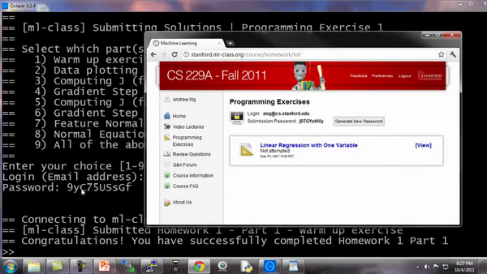

### 5.7 工作和提交的编程练习

参考视频: 5 - 7 - Working on and Submitting Programming Exercises (4 min).mkv

在这段视频中，我想很快地介绍一下这门课程做作业的流程，以及如何使用作业提交系统。这个提交系统可以即时检验你的机器学习程序答案是否正确。

在'ml-class-ex1'目录中，我们提供了大量的文件，其中有一些需要由你自己来编辑，因此第一个文件应该符合编程练习中pdf文件的要求，其中一个我们要求你编写的文件是warmUpExercise.m这个文件，这个文件只是为了确保你熟悉提交系统。

你需要做的就是提交一个5×5的矩阵，就是`A = eye(5)`这将修改该函数以产生5×5的单位矩阵，现在`warmUpExercise()`这个方程就实现了返回5x5的单位矩阵，将它保存一下，所以我已经完成了作业的第一部分。

现在回到我的 **Octave** 窗口，现在来到我的目录**C:\\Users\\ang\\Desktop\\ml-class-ex1**如果我想确保我已经实现了程序 像这样输入`warmUpExercise()`好了它返回了我们用刚才写的代码创建的一个5x5的单位矩阵。

我现在可以按如下步骤提交代码，我要在这里目录下键入`submit()`。我要提交第一部分 所以我选择输入'`1`'。这时它问我的电子邮件地址，我们打开课程网站，输入用户名密码。

按下回车键，它连接到服务器，并将其提交，然后它就会立刻告诉你：恭喜您！已成功完成作业1第1部分。这就确认了你已经做对了第一部分练习，如果你提交的答案不正确，那么它会给你一条消息，说明你没有完全答对，您还可以继续使用此提交密码，也可以生成新密码。你的密码是否会显示出来取决于你使用的操作系统。
这就是提交作业的方法，你完成家庭作业的时候，我希望你都能答对。	

