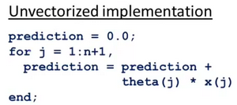
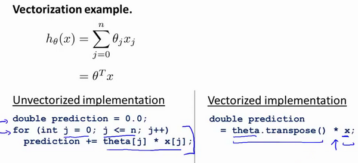
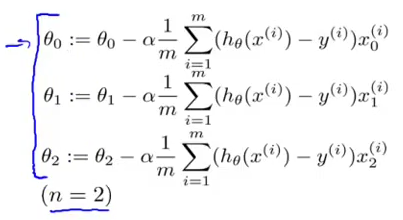
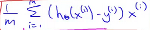
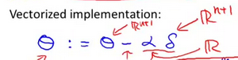
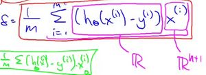
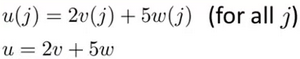

### 5.6 向量化

参考视频: 5 - 6 - Vectorization (14 min).mkv

在这段视频中，我将介绍有关向量化的内容，无论你是用**Octave**，还是别的语言，比如**MATLAB**或者你正在用**Python**、**NumPy** 或 **Java C C++**，所有这些语言都具有各种线性代数库，这些库文件都是内置的，容易阅读和获取，他们通常写得很好，已经经过高度优化，通常是数值计算方面的博士或者专业人士开发的。

而当你实现机器学习算法时，如果你能好好利用这些线性代数库，或者数值线性代数库，并联合调用它们，而不是自己去做那些函数库可以做的事情。如果是这样的话，那么通常你会发现：首先，这样更有效，也就是说运行速度更快，并且更好地利用你的计算机里可能有的一些并行硬件系统等等；其次，这也意味着你可以用更少的代码来实现你需要的功能。因此，实现的方式更简单，代码出现问题的有可能性也就越小。

举个具体的例子：与其自己写代码做矩阵乘法。如果你只在**Octave**中输入$a$乘以$b$就是一个非常有效的两个矩阵相乘的程序。有很多例子可以说明，如果你用合适的向量化方法来实现，你就会有一个简单得多，也有效得多的代码。

让我们来看一些例子：这是一个常见的线性回归假设函数：${{h}_{\theta }}(x)=\sum\limits_{j=0}^{n}{{{\theta }_{j}}{{x}_{j}}}$

如果你想要计算$h_\theta(x)$ ，注意到右边是求和，那么你可以自己计算$j = 0$ 到$ j = n$ 的和。但换另一种方式来想想，把 $h_\theta(x)$ 看作$\theta^Tx$，那么你就可以写成两个向量的内积，其中$\theta$就是$\theta_0$、$\theta_1$、$\theta_2$，如果你有两个特征量，如果 $n = 2$，并且如果你把 $x$ 看作$x_0$、$x_1$、$x_2$，这两种思考角度，会给你两种不同的实现方式。

比如说，这是未向量化的代码实现方式：

计算$h_\theta(x)$是未向量化的，我们可能首先要初始化变量 $prediction$ 的值为0.0，而这个变量$prediction$ 的最终结果就是$h_\theta(x)$，然后我要用一个 **for** 循环，$j$ 取值 0 到$n+1$，变量$prediction$ 每次就通过自身加上$ theta(j) $乘以 $x(j)$更新值，这个就是算法的代码实现。

顺便我要提醒一下，这里的向量我用的下标是0，所以我有$\theta_0$、$\theta_1$、$\theta_2$，但因为**MATLAB**的下标从1开始，在 **MATLAB** 中$\theta_0$，我们可能会用 $theta(1)$ 来表示，这第二个元素最后就会变成，$theta(2$) 而第三个元素，最终可能就用$theta(3)$表示，因为**MATLAB**中的下标从1开始，这就是为什么这里我的 **for 循环**，$j$取值从 1 直到$n+1$，而不是从 0 到 $n$。这是一个未向量化的代码实现方式，我们用一个 **for 循环**对 $n$ 个元素进行加和。

作为比较，接下来是向量化的代码实现：

你把x和$\theta$看做向量，而你只需要令变量$prediction$等于$theta$转置乘以$x$，你就可以这样计算。与其写所有这些for循环的代码，你只需要一行代码，这行代码就是利用 **Octave** 的高度优化的数值，线性代数算法来计算两个向量$\theta$以及$x$的内积，这样向量化的实现更简单，它运行起来也将更加高效。这就是 **Octave** 所做的而向量化的方法，在其他编程语言中同样可以实现。

让我们来看一个**C++** 的例子：

与此相反，使用较好的**C++**数值线性代数库，你可以写出像右边这样的代码，因此取决于你的数值线性代数库的内容。你只需要在**C++**中将两个向量相乘，根据你所使用的数值和线性代数库的使用细节的不同，你最终使用的代码表达方式可能会有些许不同，但是通过一个库来做内积，你可以得到一段更简单、更有效的代码。

现在，让我们来看一个更为复杂的例子，这是线性回归算法梯度下降的更新规则：

我们用这条规则对$ j$ 等于 0、1、2等等的所有值，更新对象$\theta_j$，我只是用$\theta_0$、$\theta_1$、$\theta_2$来写方程，假设我们有两个特征量，所以$n$等于2，这些都是我们需要对$\theta_0$、$\theta_1$、$\theta_2$进行更新，这些都应该是同步更新，我们用一个向量化的代码实现，这里是和之前相同的三个方程，只不过写得小一点而已。

你可以想象实现这三个方程的方式之一，就是用一个 **for 循环**，就是让 $j$等于0、等于1、等于2，来更新$\theta_j$。但让我们用向量化的方式来实现，看看我们是否能够有一个更简单的方法。基本上用三行代码或者一个**for 循环**，一次实现这三个方程。让我们来看看怎样能用这三步，并将它们压缩成一行向量化的代码来实现。做法如下：

我打算把$\theta$看做一个向量，然后我用$\theta$-$\alpha$ 乘以某个别的向量$\delta$ 来更新$\theta$。

这里的 $\delta$  等于

让我解释一下是怎么回事：我要把$\theta$看作一个向量，有一个 $n+1$ 维向量，$\alpha$ 是一个实数，$\delta$在这里是一个向量。

所以这个减法运算是一个向量减法，因为 $\alpha$ 乘以 δ是一个向量，所以$\theta$就是$\theta$ - $\alpha \delta$得到的向量。

那么什么是向量 $\delta$ 呢 ?

$X^{(i)}$是一个向量

你就会得到这些不同的式子，然后作加和。

实际上，在以前的一个小测验，如果你要解这个方程，我们说过为了向量化这段代码，我们会令`u = 2v +5w`因此，我们说向量$u$等于2乘以向量$v$加上5乘以向量$w$。用这个例子说明，如何对不同的向量进行相加，这里的求和是同样的道理。

这就是为什么我们能够向量化地实现线性回归。

所以，我希望步骤是有逻辑的。请务必看视频，并且保证你确实能理解它。如果你实在不能理解它们数学上等价的原因，你就直接实现这个算法，也是能得到正确答案的。所以即使你没有完全理解为何是等价的，如果只是实现这种算法，你仍然能实现线性回归算法。如果你能弄清楚为什么这两个步骤是等价的，那我希望你可以对向量化有一个更好的理解，如果你在实现线性回归的时候，使用一个或两个以上的特征量。

有时我们使用几十或几百个特征量来计算线性归回，当你使用向量化地实现线性回归，通常运行速度就会比你以前用你的**for循环**快的多，也就是自己写代码更新$\theta_0$、$\theta_1$、$\theta_2$。

因此使用向量化实现方式，你应该是能够得到一个高效得多的线性回归算法。而当你向量化我们将在之后的课程里面学到的算法，这会是一个很好的技巧，无论是对于Octave 或者一些其他的语言 如C++、Java 来让你的代码运行得更高效。

