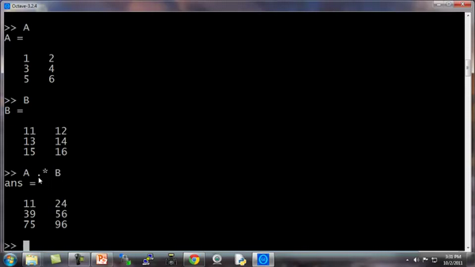
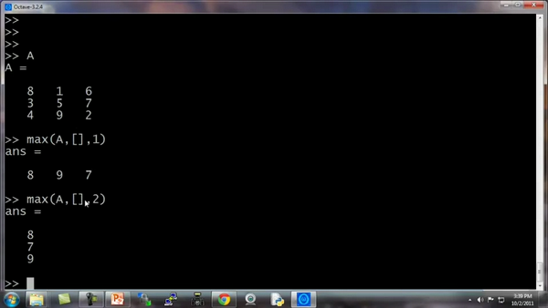

### 5.3 计算数据

参考视频: 5 - 3 - Computing on Data (13 min).mkv

现在，你已经学会了在**Octave**中如何加载或存储数据，如何把数据存入矩阵等等。在这段视频中，我将介绍如何对数据进行运算，稍后我们将使用这些运算操作来实现我们的学习算法。

这是我的 **Octave**窗口，我现在快速地初始化一些变量。比如设置$A$为一个3×2的矩阵，设置$B$为一个3 ×2矩阵，设置$C$为2 × 2矩阵。

我想算两个矩阵的乘积，比如说 $A × C$，我只需键入`A×C`，这是一个 3×2 矩阵乘以 2×2矩阵，得到这样一个3×2矩阵。

你也可以对每一个元素，做运算 方法是做点乘运算`A.*B`，这么做Octave将矩阵 $A$中的每一个元素与矩阵 $B$ 中的对应元素相乘:`A.*B`

这里第一个元素1乘以11得到11，第二个元素2乘以12得到24，这就是两个矩阵的元素位运算。通常来说，在**Octave**中点号一般用来表示元素位运算。

这里是一个矩阵$A$，这里我输入`A.^2`，这将对矩阵$A$中每一个元素平方。

我们设$V$为 [1; 2; 3] 是列向量，你也可以输入`1./V`，得到每一个元素的倒数，所以这样一来，就会分别算出 1/1 1/2 1/3。

矩阵也可以这样操作，`1./A` 得到$A$中每一个元素的倒数。

同样地，这里的点号还是表示对每一个元素进行操作。

我们还可以进行求对数运算，也就是对每个元素进行求对数运算。

还有自然数$e$的幂次运算，就是以$e$为底，以这些元素为幂的运算。

我还可以用 **abs**来对 $v$ 的每一个元素求绝对值，当然这里 $v$都是正数。我们换成另一个这样对每个元素求绝对值，得到的结果就是这些非负的元素。还有$–v$，给出$v$中每个元素的相反数，这等价于 -1 乘以 $v$，一般就直接用 $-v$
就好了，其实就等于 $-1*v$。

还有一个技巧，比如说我们想对$v$中的每个元素都加1，那么我们可以这么做，首先构造一个3行1列的1向量，然后把这个1向量跟原来的向量相加，因此$v$向量从[1 2 3] 增至 [2 3 4]。我用了一个，`length(v)`命令，因此这样一来，`ones(length(v) ,1)` 就相当于`ones(3,1)`，然后我做的是`v +ones(3,1)`，也就是将 $v$ 的各元素都加上这些1，这样就将$v$ 的每个元素增加了1。

另一种更简单的方法是直接用 `v+1`，`v + 1` 也就等于把 $v$ 中的每一个元素都加上1。

现在，让我们来谈谈更多的操作。

矩阵$A$ 如果你想要求它的转置，那么方法是用A’,将得出 A 的转置矩阵。当然，如果我写`(A')'`，也就是 $A$ 转置两次，那么我又重新得到矩阵 $A$。

还有一些有用的函数，比如： `a=[1 15 2 0.5]`，这是一个1行4列矩阵，`val=max(a)`，这将返回$A$矩阵中的最大值15。

我还可以写 `[val, ind] =max(a)`，这将返回$A$矩阵中的最大值存入$val$，以及该值对应的索引，元素15对应的索引值为2,存入$ind$，所以 $ind =2$。

特别注意一下，如果你用命令 `max(A)`，$A$是一个矩阵的话，这样做就是对每一列求最大值。

我们还是用这个例子，这个 $a$ 矩阵`a=[1 15 2 0.5]`，如果输入`a<3`，这将进行逐元素的运算，所以元素小于3的返回1，否则返回0。

因此，返回[1 1 0 1]。也就是说，对$a$矩阵的每一个元素与3进行比较，然后根据每一个元素与3的大小关系，返回1和0表示真与假。

如果我写 `find(a<3)`，这将告诉我$a$ 中的哪些元素是小于3的。

设`A = magic(3)`，**magic 函数**将返回一个矩阵，称为魔方阵或幻方 (**magic squares**)，它们具有以下这样的数学性质：它们所有的行和列和对角线加起来都等于相同的值。

当然据我所知，这在机器学习里基本用不上，但我可以用这个方法很方便地生成一个3行3列的矩阵，而这个魔方矩阵这神奇的方形屏幕。每一行、每一列、每一个对角线三个数字加起来都是等于同一个数。

在其他有用的机器学习应用中，这个矩阵其实没多大作用。

如果我输入 `[r,c] = find(A>=7)`，这将找出所有$A$矩阵中大于等于7的元素，因此，$r$ 和$c$分别表示行和列，这就表示，第一行第一列的元素大于等于7，第三行第二列的元素大于等于7，第二行第三列的元素大于等于7。

顺便说一句，其实我从来都不去刻意记住这个 **find 函数**，到底是怎么用的，我只需要会用**help函数**就可以了，每当我在使用这个函数，忘记怎么用的时候，我就可以用 **help函数**，键入 `help find` 来找到帮助文档。

最后再讲两个内容，一个是求和函数，这是 $a$ 矩阵：

键入 `sum(a)`，就把 a 中所有元素加起来了。

如果我想把它们都乘起来，键入 `prod(a)`，**prod** 意思是**product(乘积)**，它将返回这四个元素的乘积。

`floor(a)` 是向下四舍五入，因此对于 $a$ 中的元素0.5将被下舍入变成0。

还有 `ceil(a)`，表示向上四舍五入，所以0.5将上舍入变为最接近的整数，也就是1。

键入 `type(3)`，这通常得到一个3×3的矩阵，如果键入 `max(rand(3),rand(3))`，这样做的结果是返回两个3×3的随机矩阵，并且逐元素比较取最大值。

假如我输入`max(A,[],1)`，这样做会得到每一列的最大值。

所以第一列的最大值就是8，第二列是9，第三列的最大值是7，这里的1表示取A矩阵第一个维度的最大值。

相对地，如果我键入`max(A,[],2)`，这将得到每一行的最大值，所以，第一行的最大值是等于8，第二行最大值是7，第三行是9。

所以你可以用这个方法来求得每一行或每一列的最值，另外，你要知道，默认情况下`max(A)`返回的是每一列的最大值，如果你想要找出整个矩阵A的最大值，你可以输入`max(max(A))`，或者你可以将$A$ 矩阵转成一个向量，然后键入 `max(A(:))`，这样做就是把 $A$ 当做一个向量，并返回 $A$向量中的最大值。

最后，让我们把 $A$设为一个9行9列的魔方阵，魔方阵具有的特性是每行每列和对角线的求和都是相等的。

这是一个9×9的魔方阵，我们来求一个 `sum(A,1)`，这样就得到每一列的总和，这也验证了一个9×9的魔方阵确实每一列加起来都相等，都为369。

现在我们来求每一行的和，键入`sum(A,2)`，这样就得到了$A$ 中每一行的和加起来还是369。

现在我们来算$A $的对角线元素的和。我们现在构造一个9×9 的单位矩阵，键入 `eye(9)`,

然后我们要用 $A$逐点乘以这个单位矩阵，除了对角线元素外，其他元素都会得到0。

键入`sum(sum(A.*eye(9))`

这实际上是求得了，这个矩阵对角线元素的和确实是369。

你也可以求另一条对角线的和也是是369。

**flipup/flipud** 表示向上/向下翻转。

同样地，如果你想求这个矩阵的逆矩阵，键入`pinv(A)`，通常称为伪逆矩阵，你就把它看成是矩阵 $A$ 求逆，因此这就是 $A$矩阵的逆矩阵。

设 `temp = pinv(A)`，然后再用$temp$ 乘以$A$，这实际上得到的就是单位矩阵，对角线为1，其他元素为0。

如何对矩阵中的数字进行各种操作，在运行完某个学习算法之后，通常一件最有用的事情是看看你的结果，或者说让你的结果可视化，在接下来的视频中，我会非常迅速地告诉你，如何很快地画图，如何只用一两行代码，你就可以快速地可视化你的数据，这样你就能更好地理解你使用的学习算法。

