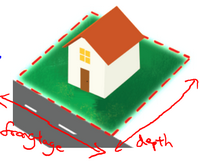

### 4.5 特征和多项式回归

参考视频: 4 - 5 - Features and Polynomial Regression (8 min).mkv

如房价预测问题，

$h_{\theta}\left( x \right)={\theta_{0}}+{\theta_{1}}\times{frontage}+{\theta_{2}}\times{depth}$ 

${x_{1}}=frontage$（临街宽度），${x_{2}}=depth$（纵向深度），$x=frontage*depth=area$（面积），则：${h_{\theta}}\left( x \right)={\theta_{0}}+{\theta_{1}}x$。
线性回归并不适用于所有数据，有时我们需要曲线来适应我们的数据，比如一个二次方模型：$h_{\theta}\left( x \right)={\theta_{0}}+{\theta_{1}}{x_{1}}+{\theta_{2}}{x_{2}^2}$
 或者三次方模型： $h_{\theta}\left( x \right)={\theta_{0}}+{\theta_{1}}{x_{1}}+{\theta_{2}}{x_{2}^2}+{\theta_{3}}{x_{3}^3}$ 

通常我们需要先观察数据然后再决定准备尝试怎样的模型。 另外，我们可以令：

${{x}_{2}}=x_{2}^{2},{{x}_{3}}=x_{3}^{3}$，从而将模型转化为线性回归模型。

根据函数图形特性，我们还可以使：

${{{h}}_{\theta}}(x)={{\theta }_{0}}\text{+}{{\theta }_{1}}(size)+{{\theta}_{1}}{{(size)}^{2}}$

或者:

${{{h}}_{\theta}}(x)={{\theta }_{0}}\text{+}{{\theta }_{1}}(size)+{{\theta }_{1}}\sqrt{size}$

注：如果我们采用多项式回归模型，在运行梯度下降算法前，特征缩放非常有必要。

