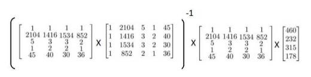

### 4.6 正规方程

参考视频: 4 - 6 - Normal Equation (16 min).mkv

到目前为止，我们都在使用梯度下降算法，但是对于某些线性回归问题，正规方程方法是更好的解决方案。如：


正规方程是通过求解下面的方程来找出使得代价函数最小的参数的：$\frac{\partial}{\partial{\theta_{j}}}J\left( {\theta_{j}} \right)=0$ 。
 假设我们的训练集特征矩阵为 $X$（包含了 ${{x}_{0}}=1$）并且我们的训练集结果为向量 $y$，则利用正规方程解出向量 $\theta ={{\left( {X^T}X \right)}^{-1}}{X^{T}}y$ 。
上标**T**代表矩阵转置，上标-1 代表矩阵的逆。设矩阵$A={X^{T}}X$，则：${{\left( {X^T}X \right)}^{-1}}={A^{-1}}$
以下表示数据为例：


即：


运用正规方程方法求解参数：



在 **Octave** 中，正规方程写作：

```
pinv(X'*X)*X'*y
```

注：对于那些不可逆的矩阵（通常是因为特征之间不独立，如同时包含英尺为单位的尺寸和米为单位的尺寸两个特征，也有可能是特征数量大于训练集的数量），正规方程方法是不能用的。

梯度下降与正规方程的比较：

| 梯度下降             | 正规方程                                     |
| ---------------- | ---------------------------------------- |
| 需要选择学习率$\alpha$  | 不需要                                      |
| 需要多次迭代           | 一次运算得出                                   |
| 当特征数量$n$大时也能较好适用 | 需要计算${{\left( {{X}^{T}}X \right)}^{-1}}$ 如果特征数量n较大则运算代价大，因为矩阵逆的计算时间复杂度为$O\left( {{n}^{3}} \right)$，通常来说当$n$小于10000 时还是可以接受的 |
| 适用于各种类型的模型       | 只适用于线性模型，不适合逻辑回归模型等其他模型                  |

总结一下，只要特征变量的数目并不大，标准方程是一个很好的计算参数$\theta $的替代方法。具体地说，只要特征变量数量小于一万，我通常使用标准方程法，而不使用梯度下降法。

随着我们要讲的学习算法越来越复杂，例如，当我们讲到分类算法，像逻辑回归算法，我们会看到，实际上对于那些算法，并不能使用标准方程法。对于那些更复杂的学习算法，我们将不得不仍然使用梯度下降法。因此，梯度下降法是一个非常有用的算法，可以用在有大量特征变量的线性回归问题。或者我们以后在课程中，会讲到的一些其他的算法，因为标准方程法不适合或者不能用在它们上。但对于这个特定的线性回归模型，标准方程法是一个比梯度下降法更快的替代算法。所以，根据具体的问题，以及你的特征变量的数量，这两种算法都是值得学习的。

正规方程的**python**实现：

```python
import numpy as np
    
 def normalEqn(X, y):
    
   theta = np.linalg.inv(X.T@X)@X.T@y #X.T@X等价于X.T.dot(X)
    
   return theta
```


