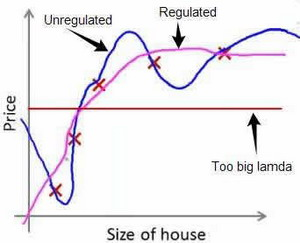

### 7.2 代价函数

参考视频: 7 - 2 - Cost Function (10 min).mkv

上面的回归问题中如果我们的模型是：
${h_\theta}\left( x \right)={\theta_{0}}+{\theta_{1}}{x_{1}}+{\theta_{2}}{x_{2}^2}+{\theta_{3}}{x_{3}^3}+{\theta_{4}}{x_{4}^4}$
我们可以从之前的事例中看出，正是那些高次项导致了过拟合的产生，所以如果我们能让这些高次项的系数接近于0的话，我们就能很好的拟合了。
所以我们要做的就是在一定程度上减小这些参数$\theta $ 的值，这就是正则化的基本方法。我们决定要减少${\theta_{3}}$和${\theta_{4}}$的大小，我们要做的便是修改代价函数，在其中${\theta_{3}}$和${\theta_{4}}$ 设置一点惩罚。这样做的话，我们在尝试最小化代价时也需要将这个惩罚纳入考虑中，并最终导致选择较小一些的${\theta_{3}}$和${\theta_{4}}$。
修改后的代价函数如下：$\underset{\theta }{\mathop{\min }}\,\frac{1}{2m}[\sum\limits_{i=1}^{m}{{{\left( {{h}_{\theta }}\left( {{x}^{(i)}} \right)-{{y}^{(i)}} \right)}^{2}}+1000\theta _{3}^{2}+10000\theta _{4}^{2}]}$

通过这样的代价函数选择出的${\theta_{3}}$和${\theta_{4}}$ 对预测结果的影响就比之前要小许多。假如我们有非常多的特征，我们并不知道其中哪些特征我们要惩罚，我们将对所有的特征进行惩罚，并且让代价函数最优化的软件来选择这些惩罚的程度。这样的结果是得到了一个较为简单的能防止过拟合问题的假设：$J\left( \theta  \right)=\frac{1}{2m}[\sum\limits_{i=1}^{m}{{{({h_\theta}({{x}^{(i)}})-{{y}^{(i)}})}^{2}}+\lambda \sum\limits_{j=1}^{n}{\theta_{j}^{2}}]}$

其中$\lambda $又称为正则化参数（**Regularization Parameter**）。 注：根据惯例，我们不对${\theta_{0}}$ 进行惩罚。经过正则化处理的模型与原模型的可能对比如下图所示：

如果选择的正则化参数λ过大，则会把所有的参数都最小化了，导致模型变成 ${h_\theta}\left( x \right)={\theta_{0}}$，也就是上图中红色直线所示的情况，造成欠拟合。
那为什么增加的一项$\lambda =\sum\limits_{j=1}^{n}{\theta_j^{2}}$ 可以使$\theta $的值减小呢？
因为如果我们令 $\lambda$ 的值很大的话，为了使**Cost Function** 尽可能的小，所有的 $\theta $ 的值（不包括${\theta_{0}}$）都会在一定程度上减小。
但若λ的值太大了，那么$\theta $（不包括${\theta_{0}}$）都会趋近于0，这样我们所得到的只能是一条平行于$x$轴的直线。
所以对于正则化，我们要取一个合理的 $\lambda$ 的值，这样才能更好的应用正则化。
回顾一下代价函数，为了使用正则化，让我们把这些概念应用到到线性回归和逻辑回归中去，那么我们就可以让他们避免过度拟合了。

