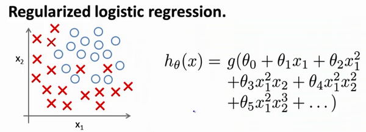

### 7.4 正则化的逻辑回归模型

参考视频: 7 - 4 - Regularized Logistic Regression (9 min).mkv

针对逻辑回归问题，我们在之前的课程已经学习过两种优化算法：我们首先学习了使用梯度下降法来优化代价函数$J\left( \theta  \right)$，接下来学习了更高级的优化算法，这些高级优化算法需要你自己设计代价函数$J\left( \theta  \right)$。



自己计算导数同样对于逻辑回归，我们也给代价函数增加一个正则化的表达式，得到代价函数：

$J\left( \theta  \right)=\frac{1}{m}\sum\limits_{i=1}^{m}{[-{{y}^{(i)}}\log \left( {h_\theta}\left( {{x}^{(i)}} \right) \right)-\left( 1-{{y}^{(i)}} \right)\log \left( 1-{h_\theta}\left( {{x}^{(i)}} \right) \right)]}+\frac{\lambda }{2m}\sum\limits_{j=1}^{n}{\theta _{j}^{2}}$

**Python**代码：

```python
import numpy as np

def costReg(theta, X, y, learningRate):
    theta = np.matrix(theta)
    X = np.matrix(X)
    y = np.matrix(y)
    first = np.multiply(-y, np.log(sigmoid(X*theta.T)))
    second = np.multiply((1 - y), np.log(1 - sigmoid(X*theta.T)))
    reg = (learningRate / (2 * len(X))* np.sum(np.power(theta[:,1:theta.shape[1]],2))
    return np.sum(first - second) / (len(X)) + reg
```

要最小化该代价函数，通过求导，得出梯度下降算法为：

$Repeat$  $until$  $convergence${

​       ${\theta_0}:={\theta_0}-a\frac{1}{m}\sum\limits_{i=1}^{m}{(({h_\theta}({{x}^{(i)}})-{{y}^{(i)}})x_{0}^{(i)}})$ 

​       ${\theta_j}:={\theta_j}-a\frac{1}{m}\sum\limits_{i=1}^{m}{(({h_\theta}({{x}^{(i)}})-{{y}^{(i)}})x_{j}^{\left( i \right)}}+\frac{\lambda }{m}{\theta_j})$ 

​                                            $for$ $j=1,2,...n$

​                       }

注：看上去同线性回归一样，但是知道 ${h_\theta}\left( x \right)=g\left( {\theta^T}X \right)$，所以与线性回归不同。
**Octave** 中，我们依旧可以用 `fminuc` 函数来求解代价函数最小化的参数，值得注意的是参数${\theta_{0}}$的更新规则与其他情况不同。
注意：

1. 虽然正则化的逻辑回归中的梯度下降和正则化的线性回归中的表达式看起来一样，但由于两者的${h_\theta}\left( x \right)$不同所以还是有很大差别。

2. ${\theta_{0}}$不参与其中的任何一个正则化。

目前大家对机器学习算法可能还只是略懂，但是一旦你精通了线性回归、高级优化算法和正则化技术，坦率地说，你对机器学习的理解可能已经比许多工程师深入了。现在，你已经有了丰富的机器学习知识，目测比那些硅谷工程师还厉害，或者用机器学习算法来做产品。

接下来的课程中，我们将学习一个非常强大的非线性分类器，无论是线性回归问题，还是逻辑回归问题，都可以构造多项式来解决。你将逐渐发现还有更强大的非线性分类器，可以用来解决多项式回归问题。我们接下来将将学会，比现在解决问题的方法强大N倍的学习算法。

