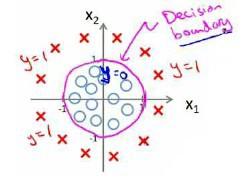

### 6.3 判定边界

参考视频: 6 - 3 - Decision Boundary (15 min).mkv

现在讲下决策边界(**decision boundary**)的概念。这个概念能更好地帮助我们理解逻辑回归的假设函数在计算什么。

在逻辑回归中，我们预测：

当${h_\theta}\left( x \right)>=0.5$时，预测 $y=1$。

当${h_\theta}\left( x \right)<0.5$时，预测 $y=0$ 。

根据上面绘制出的 **S** 形函数图像，我们知道当

$z=0$ 时 $g(z)=0.5$

$z>0$ 时 $g(z)>0.5$

$z<0$ 时 $g(z)<0.5$

又 $z={\theta^{T}}x$ ，即：
${\theta^{T}}x>=0$  时，预测 $y=1$
${\theta^{T}}x<0$  时，预测 $y=0$

现在假设我们有一个模型：

并且参数$\theta$ 是向量[-3 1 1]。 则当$-3+{x_1}+{x_2} \geq 0$，即${x_1}+{x_2} \geq 3$时，模型将预测 $y=1$。
我们可以绘制直线${x_1}+{x_2} = 3$，这条线便是我们模型的分界线，将预测为1的区域和预测为 0的区域分隔开。

假使我们的数据呈现这样的分布情况，怎样的模型才能适合呢？

因为需要用曲线才能分隔 $y=0$ 的区域和 $y=1$ 的区域，我们需要二次方特征：${h_\theta}\left( x \right)=g\left( {\theta_0}+{\theta_1}{x_1}+{\theta_{2}}{x_{2}}+{\theta_{3}}x_{1}^{2}+{\theta_{4}}x_{2}^{2} \right)$是[-1 0 0 1 1]，则我们得到的判定边界恰好是圆点在原点且半径为1的圆形。

我们可以用非常复杂的模型来适应非常复杂形状的判定边界。

