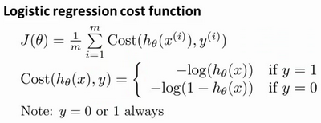
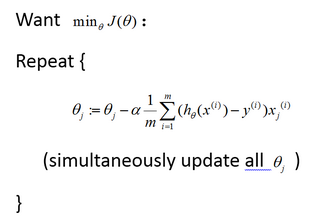

### 6.5 简化的成本函数和梯度下降

参考视频: 6 - 5 - Simplified Cost Function and Gradient Descent (10 min).mkv

在这段视频中，我们将会找出一种稍微简单一点的方法来写代价函数，来替换我们现在用的方法。同时我们还要弄清楚如何运用梯度下降法，来拟合出逻辑回归的参数。因此，听了这节课，你就应该知道如何实现一个完整的逻辑回归算法。

这就是逻辑回归的代价函数：

这个式子可以合并成：

$Cost\left( {h_\theta}\left( x \right),y \right)=-y\times log\left( {h_\theta}\left( x \right) \right)-(1-y)\times log\left( 1-{h_\theta}\left( x \right) \right)$
即，逻辑回归的代价函数：
$Cost\left( {h_\theta}\left( x \right),y \right)=-y\times log\left( {h_\theta}\left( x \right) \right)-(1-y)\times log\left( 1-{h_\theta}\left( x \right) \right)$
$=-\frac{1}{m}\sum\limits_{i=1}^{m}{[{{y}^{(i)}}\log \left( {h_\theta}\left( {{x}^{(i)}} \right) \right)+\left( 1-{{y}^{(i)}} \right)\log \left( 1-{h_\theta}\left( {{x}^{(i)}} \right) \right)]}$
根据这个代价函数，为了拟合出参数，该怎么做呢？我们要试图找尽量让$J\left( \theta  \right)$ 取得最小值的参数$\theta $。
$\underset{\theta}{\min }J\left( \theta  \right)$ 
所以我们想要尽量减小这一项，这将我们将得到某个参数$\theta $。
如果我们给出一个新的样本，假如某个特征 $x$，我们可以用拟合训练样本的参数$\theta $，来输出对假设的预测。
另外，我们假设的输出，实际上就是这个概率值：$p(y=1|x;\theta)$，就是关于 $x$以$\theta $为参数，$y=1$ 的概率，你可以认为我们的假设就是估计 $y=1$ 的概率，所以，接下来就是弄清楚如何最大限度地最小化代价函数$J\left( \theta  \right)$，作为一个关于$\theta $的函数，这样我们才能为训练集拟合出参数$\theta $。

最小化代价函数的方法，是使用**梯度下降法**(**gradient descent**)。这是我们的代价函数：
$J\left( \theta  \right)=-\frac{1}{m}\sum\limits_{i=1}^{m}{[{{y}^{(i)}}\log \left( {h_\theta}\left( {{x}^{(i)}} \right) \right)+\left( 1-{{y}^{(i)}} \right)\log \left( 1-{h_\theta}\left( {{x}^{(i)}} \right) \right)]}$

如果我们要最小化这个关于$\theta$的函数值，这就是我们通常用的梯度下降法的模板。

我们要反复更新每个参数，用这个式子来更新，就是用它自己减去学习率 $\alpha$
乘以后面的微分项。求导后得到：

如果你计算一下的话，你会得到这个等式：
${\theta_j}:={\theta_j}-\alpha \frac{1}{m}\sum\limits_{i=1}^{m}{({h_\theta}({{x}^{(i)}})-{{y}^{(i)}}){x_{j}}^{(i)}}$
我把它写在这里，将后面这个式子，在 $i=1$  到 $m$ 上求和，其实就是预测误差乘以$x_j^{(i)}$ ，所以你把这个偏导数项$\frac{\partial }{\partial {\theta_j}}J\left( \theta  \right)$放回到原来式子这里，我们就可以将梯度下降算法写作如下形式：
${\theta_j}:={\theta_j}-\alpha \frac{1}{m}\sum\limits_{i=1}^{m}{({h_\theta}({{x}^{(i)}})-{{y}^{(i)}}){x_{j}}^{(i)}}$

所以，如果你有 $n$ 个特征，也就是说：，参数向量$\theta $包括${\theta_{0}}$ ${\theta_{1}}$ ${\theta_{2}}$ 一直到${\theta_{n}}$，那么你就需要用这个式子：

${\theta_j}:={\theta_j}-\alpha \frac{1}{m}\sum\limits_{i=1}^{m}{({h_\theta}({{x}^{(i)}})-{{y}^{(i)}}){{x}_{j}}^{(i)}}$来同时更新所有$\theta $的值。

现在，如果你把这个更新规则和我们之前用在线性回归上的进行比较的话，你会惊讶地发现，这个式子正是我们用来做线性回归梯度下降的。

那么，线性回归和逻辑回归是同一个算法吗？要回答这个问题，我们要观察逻辑回归看看发生了哪些变化。实际上，假设的定义发生了变化。

对于线性回归假设函数：

${h_\theta}\left( x \right)={\theta^T}X={\theta_{0}}{x_{0}}+{\theta_{1}}{x_{1}}+{\theta_{2}}{x_{2}}+...+{\theta_{n}}{x_{n}}$

而现在逻辑函数假设函数：

${h_\theta}\left( x \right)=\frac{1}{1+{{e}^{-{\theta^T}X}}}$

因此，即使更新参数的规则看起来基本相同，但由于假设的定义发生了变化，所以逻辑函数的梯度下降，跟线性回归的梯度下降实际上是两个完全不同的东西。

在先前的视频中，当我们在谈论线性回归的梯度下降法时，我们谈到了如何监控梯度下降法以确保其收敛，我通常也把同样的方法用在逻辑回归中，来监测梯度下降，以确保它正常收敛。

当使用梯度下降法来实现逻辑回归时，我们有这些不同的参数$\theta $，就是${\theta_{0}}$ ${\theta_{1}}$ ${\theta_{2}}$ 一直到${\theta_{n}}$，我们需要用这个表达式来更新这些参数。我们还可以使用 **for循环**来更新这些参数值，用 `for i=1 to n`，或者 `for i=1 to n+1`。当然，不用 **for循环**也是可以的，理想情况下，我们更提倡使用向量化的实现，可以把所有这些 n个参数同时更新。

最后还有一点，我们之前在谈线性回归时讲到的特征缩放，我们看到了特征缩放是如何提高梯度下降的收敛速度的，这个特征缩放的方法，也适用于逻辑回归。如果你的特征范围差距很大的话，那么应用特征缩放的方法，同样也可以让逻辑回归中，梯度下降收敛更快。

就是这样，现在你知道如何实现逻辑回归，这是一种非常强大，甚至可能世界上使用最广泛的一种分类算法。

