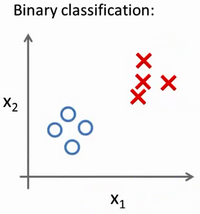
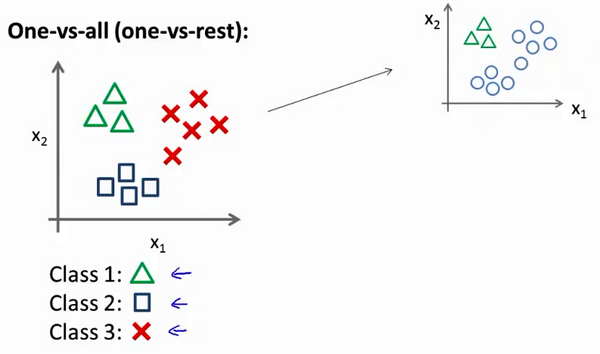

### 6.7 多类别分类：一对多

参考视频: 6 - 7 - Multiclass Classification\_ One-vs-all (6 min).mkv

在本节视频中，我们将谈到如何使用逻辑回归 (**logistic regression**)来解决多类别分类问题，具体来说，我想通过一个叫做"一对多" (**one-vs-all**) 的分类算法。

先看这样一些例子。

第一个例子：假如说你现在需要一个学习算法能自动地将邮件归类到不同的文件夹里，或者说可以自动地加上标签，那么，你也许需要一些不同的文件夹，或者不同的标签来完成这件事，来区分开来自工作的邮件、来自朋友的邮件、来自家人的邮件或者是有关兴趣爱好的邮件，那么，我们就有了这样一个分类问题：其类别有四个，分别用$y=1$、$y=2$、$y=3$、$y=4$ 来代表。

第二个例子是有关药物诊断的，如果一个病人因为鼻塞来到你的诊所，他可能并没有生病，用 $y=1$ 这个类别来代表；或者患了感冒，用 $y=2$ 来代表；或者得了流感用$y=3$来代表。

第三个例子：如果你正在做有关天气的机器学习分类问题，那么你可能想要区分哪些天是晴天、多云、雨天、或者下雪天，对上述所有的例子，$y$ 可以取一个很小的数值，一个相对"谨慎"的数值，比如1 到3、1到4或者其它数值，以上说的都是多类分类问题，顺便一提的是，对于下标是0 1 2 3，还是 1 2 3 4 都不重要，我更喜欢将分类从 1 开始标而不是0，其实怎样标注都不会影响最后的结果。

然而对于之前的一个，二元分类问题，我们的数据看起来可能是像这样：

对于一个多类分类问题，我们的数据集或许看起来像这样：

我用3种不同的符号来代表3个类别，问题就是给出3个类型的数据集，我们如何得到一个学习算法来进行分类呢？

我们现在已经知道如何进行二元分类，可以使用逻辑回归，对于直线或许你也知道，可以将数据集一分为二为正类和负类。用一对多的分类思想，我们可以将其用在多类分类问题上。

下面将介绍如何进行一对多的分类工作，有时这个方法也被称为"一对余"方法。

现在我们有一个训练集，好比上图表示的有3个类别，我们用三角形表示 $y=1$，方框表示$y=2$，叉叉表示 $y=3$。我们下面要做的就是使用一个训练集，将其分成3个二元分类问题。

我们先从用三角形代表的类别1开始，实际上我们可以创建一个，新的"伪"训练集，类型2和类型3定为负类，类型1设定为正类，我们创建一个新的训练集，如下图所示的那样，我们要拟合出一个合适的分类器。

这里的三角形是正样本，而圆形代表负样本。可以这样想，设置三角形的值为1，圆形的值为0，下面我们来训练一个标准的逻辑回归分类器，这样我们就得到一个正边界。

为了能实现这样的转变，我们将多个类中的一个类标记为正向类（$y=1$），然后将其他所有类都标记为负向类，这个模型记作$h_\theta^{\left( 1 \right)}\left( x \right)$。接着，类似地第我们选择另一个类标记为正向类（$y=2$），再将其它类都标记为负向类，将这个模型记作 $h_\theta^{\left( 2 \right)}\left( x \right)$,依此类推。
最后我们得到一系列的模型简记为： $h_\theta^{\left( i \right)}\left( x \right)=p\left( y=i|x;\theta  \right)$其中：$i=\left( 1,2,3....k \right)$ 

最后，在我们需要做预测时，我们将所有的分类机都运行一遍，然后对每一个输入变量，都选择最高可能性的输出变量。

总之，我们已经把要做的做完了，现在要做的就是训练这个逻辑回归分类器：$h_\theta^{\left( i \right)}\left( x \right)$， 其中 $i$ 对应每一个可能的 $y=i$，最后，为了做出预测，我们给出输入一个新的 $x$ 值，用这个做预测。我们要做的就是在我们三个分类器里面输入 $x$，然后我们选择一个让 $h_\theta^{\left( i \right)}\left( x \right)$ 最大的$ i$，即$\mathop{\max}\limits_i\,h_\theta^{\left( i \right)}\left( x \right)$。

你现在知道了基本的挑选分类器的方法，选择出哪一个分类器是可信度最高效果最好的，那么就可认为得到一个正确的分类，无论$i$值是多少，我们都有最高的概率值，我们预测$y$就是那个值。这就是多类别分类问题，以及一对多的方法，通过这个小方法，你现在也可以将逻辑回归分类器用在多类分类的问题上。

七、正则化(Regularization)
--------------------------

