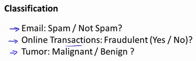
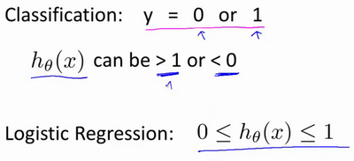

### 6.1 分类问题

参考文档: 6 - 1 - Classification (8 min).mkv

在这个以及接下来的几个视频中，开始介绍分类问题。

在分类问题中，你要预测的变量 $y$ 是离散的值，我们将学习一种叫做逻辑回归 (**Logistic Regression**) 的算法，这是目前最流行使用最广泛的一种学习算法。

在分类问题中，我们尝试预测的是结果是否属于某一个类（例如正确或错误）。分类问题的例子有：判断一封电子邮件是否是垃圾邮件；判断一次金融交易是否是欺诈；之前我们也谈到了肿瘤分类问题的例子，区别一个肿瘤是恶性的还是良性的。

我们从二元的分类问题开始讨论。

我们将因变量(**dependent variable**)可能属于的两个类分别称为负向类（**negative class**）和正向类（**positive class**），则因变量$y\in { 0,1 \\}$ ，其中 0 表示负向类，1 表示正向类。

如果我们要用线性回归算法来解决一个分类问题，对于分类， $y$ 取值为 0 或者1，但如果你使用的是线性回归，那么假设函数的输出值可能远大于 1，或者远小于0，即使所有训练样本的标签  $y$ 都等于 0 或 1。尽管我们知道标签应该取值0 或者1，但是如果算法得到的值远大于1或者远小于0的话，就会感觉很奇怪。所以我们在接下来的要研究的算法就叫做逻辑回归算法，这个算法的性质是：它的输出值永远在0到 1 之间。

顺便说一下，逻辑回归算法是分类算法，我们将它作为分类算法使用。有时候可能因为这个算法的名字中出现了“回归”使你感到困惑，但逻辑回归算法实际上是一种分类算法，它适用于标签  $y$ 取值离散的情况，如：1 0 0 1。

在接下来的视频中，我们将开始学习逻辑回归算法的细节。

