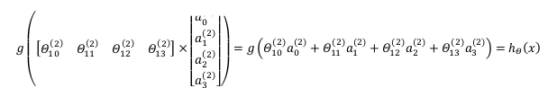
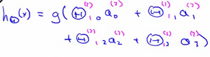

### 8.4 模型表示2

参考视频: 8 - 4 - Model Representation II (12 min).mkv

( **FORWARD PROPAGATION** )
相对于使用循环来编码，利用向量化的方法会使得计算更为简便。以上面的神经网络为例，试着计算第二层的值：

我们令 ${{z}^{\left( 2 \right)}}={{\theta }^{\left( 1 \right)}}x$，则 ${{a}^{\left( 2 \right)}}=g({{z}^{\left( 2 \right)}})$ ，计算后添加 $a_{0}^{\left( 2 \right)}=1$。 计算输出的值为：

我们令 ${{z}^{\left( 3 \right)}}={{\theta }^{\left( 2 \right)}}{{a}^{\left( 2 \right)}}$，则 $h_\theta(x)={{a}^{\left( 3 \right)}}=g({{z}^{\left( 3 \right)}})$。
这只是针对训练集中一个训练实例所进行的计算。如果我们要对整个训练集进行计算，我们需要将训练集特征矩阵进行转置，使得同一个实例的特征都在同一列里。即：
${{z}^{\left( 2 \right)}}={{\Theta }^{\left( 1 \right)}}\times {{X}^{T}} $

 ${{a}^{\left( 2 \right)}}=g({{z}^{\left( 2 \right)}})$

为了更好了了解**Neuron Networks**的工作原理，我们先把左半部分遮住：

右半部分其实就是以$a_0, a_1, a_2, a_3$, 按照**Logistic Regression**的方式输出$h_\theta(x)$：

其实神经网络就像是logistic regression，只不过我们把**logistic regression**中的输入向量$\left[ x_1\sim {x_3} \right]$ 变成了中间层的$\left[ a_1^{(2)}\sim a_3^{(2)} \right]$, 即:  $h_\theta(x)=g\left( \theta_0^{\left( 2 \right)}a_0^{\left( 2 \right)}+\theta_1^{\left( 2 \right)}a_1^{\left( 2 \right)}+\theta_{2}^{\left( 2 \right)}a_{2}^{\left( 2 \right)}+\theta_{3}^{\left( 2 \right)}a_{3}^{\left( 2 \right)} \right)$ 
我们可以把$a_0, a_1, a_2, a_3$看成更为高级的特征值，也就是$x_0, x_1, x_2, x_3$的进化体，并且它们是由 $x$与决定的，因为是梯度下降的，所以$a$是变化的，并且变得越来越厉害，所以这些更高级的特征值远比仅仅将 $x$次方厉害，也能更好的预测新数据。
这就是神经网络相比于逻辑回归和线性回归的优势。

