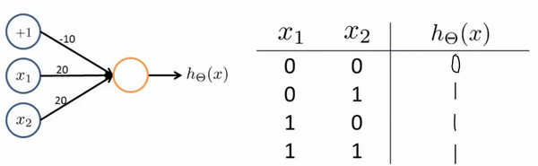

### 8.5 特征和直观理解1

参考视频: 8 - 5 - Examples and Intuitions I (7 min).mkv

从本质上讲，神经网络能够通过学习得出其自身的一系列特征。在普通的逻辑回归中，我们被限制为使用数据中的原始特征$x_1,x_2,...,{{x}_{n}}$，我们虽然可以使用一些二项式项来组合这些特征，但是我们仍然受到这些原始特征的限制。在神经网络中，原始特征只是输入层，在我们上面三层的神经网络例子中，第三层也就是输出层做出的预测利用的是第二层的特征，而非输入层中的原始特征，我们可以认为第二层中的特征是神经网络通过学习后自己得出的一系列用于预测输出变量的新特征。

神经网络中，单层神经元（无中间层）的计算可用来表示逻辑运算，比如逻辑与(**AND**)、逻辑或(**OR**)。

举例说明：逻辑与(**AND**)；下图中左半部分是神经网络的设计与**output**层表达式，右边上部分是**sigmod**函数，下半部分是真值表。

我们可以用这样的一个神经网络表示**AND** 函数：

其中$\theta_0 = -30, \theta_1 = 20, \theta_2 = 20$
我们的输出函数$h_\theta(x)$即为：$h_\Theta(x)=g\left( -30+20x_1+20x_2 \right)$

我们知道$g(x)$的图像是：

所以我们有：$h_\Theta(x) \approx \text{x}_1 \text{AND} \, \text{x}_2$

所以我们的：

这就是**AND**函数。

接下来再介绍一个**OR**函数：

**OR**与**AND**整体一样，区别只在于的取值不同。

