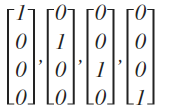

### 8.7 多类分类

参考视频: 8 - 7 - Multiclass Classification (4 min).mkv

当我们有不止两种分类时（也就是$y=1,2,3….$），比如以下这种情况，该怎么办？如果我们要训练一个神经网络算法来识别路人、汽车、摩托车和卡车，在输出层我们应该有4个值。例如，第一个值为1或0用于预测是否是行人，第二个值用于判断是否为汽车。

输入向量$x$有三个维度，两个中间层，输出层4个神经元分别用来表示4类，也就是每一个数据在输出层都会出现${{\left[ a\text{ }b\text{ }c\text{ }d \right]}^{T}}$，且$a,b,c,d$中仅有一个为1，表示当前类。下面是该神经网络的可能结构示例：

神经网络算法的输出结果为四种可能情形之一：

