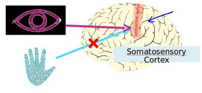
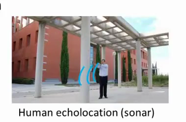
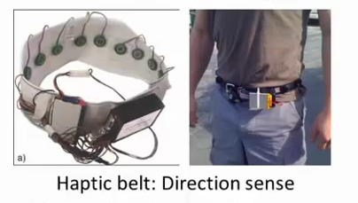

### 8.2 神经元和大脑

参考视频: 8 - 2 - Neurons and the Brain (8 min).mkv

神经网络是一种很古老的算法，它最初产生的目的是制造能模拟大脑的机器。

在这门课中，我将向你们介绍神经网络。因为它能很好地解决不同的机器学习问题。而不只因为它们在逻辑上行得通，在这段视频中，我想告诉你们一些神经网络的背景知识，由此我们能知道可以用它们来做什么。不管是将其应用到现代的机器学习问题上，还是应用到那些你可能会感兴趣的问题中。也许，这一伟大的人工智能梦想在未来能制造出真正的智能机器。另外，我们还将讲解神经网络是怎么涉及这些问题的神经网络产生的原因是人们想尝试设计出模仿大脑的算法，从某种意义上说如果我们想要建立学习系统，那为什么不去模仿我们所认识的最神奇的学习机器——人类的大脑呢？

神经网络逐渐兴起于二十世纪八九十年代，应用得非常广泛。但由于各种原因，在90年代的后期应用减少了。但是最近，神经网络又东山再起了。其中一个原因是：神经网络是计算量有些偏大的算法。然而大概由于近些年计算机的运行速度变快，才足以真正运行起大规模的神经网络。正是由于这个原因和其他一些我们后面会讨论到的技术因素，如今的神经网络对于许多应用来说是最先进的技术。当你想模拟大脑时，是指想制造出与人类大脑作用效果相同的机器。大脑可以学会去以看而不是听的方式处理图像，学会处理我们的触觉。

我们能学习数学，学着做微积分，而且大脑能处理各种不同的令人惊奇的事情。似乎如果你想要模仿它，你得写很多不同的软件来模拟所有这些五花八门的奇妙的事情。不过能不能假设大脑做所有这些，不同事情的方法，不需要用上千个不同的程序去实现。相反的，大脑处理的方法，只需要一个单一的学习算法就可以了？尽管这只是一个假设，不过让我和你分享，一些这方面的证据。

大脑的这一部分这一小片红色区域是你的听觉皮层，你现在正在理解我的话，这靠的是耳朵。耳朵接收到声音信号，并把声音信号传递给你的听觉皮层，正因如此，你才能明白我的话。

神经系统科学家做了下面这个有趣的实验，把耳朵到听觉皮层的神经切断。在这种情况下，将其重新接到一个动物的大脑上，这样从眼睛到视神经的信号最终将传到听觉皮层。如果这样做了。那么结果表明听觉皮层将会学会“看”。这里的“看”代表了我们所知道的每层含义。所以，如果你对动物这样做，那么动物就可以完成视觉辨别任务，它们可以看图像，并根据图像做出适当的决定。它们正是通过脑组织中的这个部分完成的。下面再举另一个例子，这块红色的脑组织是你的躯体感觉皮层，这是你用来处理触觉的，如果你做一个和刚才类似的重接实验，那么躯体感觉皮层也能学会“看”。这个实验和其它一些类似的实验，被称为神经重接实验，从这个意义上说，如果人体有同一块脑组织可以处理光、声或触觉信号，那么也许存在一种学习算法，可以同时处理视觉、听觉和触觉，而不是需要运行上千个不同的程序，或者上千个不同的算法来做这些大脑所完成的成千上万的美好事情。也许我们需要做的就是找出一些近似的或实际的大脑学习算法，然后实现它大脑通过自学掌握如何处理这些不同类型的数据。在很大的程度上，可以猜想如果我们把几乎任何一种传感器接入到大脑的几乎任何一个部位的话，大脑就会学会处理它。

下面再举几个例子：

这张图是用舌头学会“看”的一个例子。它的原理是：这实际上是一个名为**BrainPort**的系统，它现在正在**FDA**
(美国食品和药物管理局)的临床试验阶段，它能帮助失明人士看见事物。它的原理是，你在前额上带一个灰度摄像头，面朝前，它就能获取你面前事物的低分辨率的灰度图像。你连一根线到舌头上安装的电极阵列上，那么每个像素都被映射到你舌头的某个位置上，可能电压值高的点对应一个暗像素电压值低的点。对应于亮像素，即使依靠它现在的功能，使用这种系统就能让你我在几十分钟里就学会用我们的舌头“看”东西。

这是第二个例子，关于人体回声定位或者说人体声纳。你有两种方法可以实现：你可以弹响指，或者咂舌头。不过现在有失明人士，确实在学校里接受这样的培训，并学会解读从环境反弹回来的声波模式—这就是声纳。如果你搜索**YouTube**之后，就会发现有些视频讲述了一个令人称奇的孩子，他因为癌症眼球惨遭移除，虽然失去了眼球，但是通过打响指，他可以四处走动而不撞到任何东西，他能滑滑板，他可以将篮球投入篮框中。注意这是一个没有眼球的孩子。

第三个例子是触觉皮带，如果你把它戴在腰上，蜂鸣器会响，而且总是朝向北时发出嗡嗡声。它可以使人拥有方向感，用类似于鸟类感知方向的方式。

还有一些离奇的例子：

如果你在青蛙身上插入第三只眼，青蛙也能学会使用那只眼睛。因此，这将会非常令人惊奇。如果你能把几乎任何传感器接入到大脑中，大脑的学习算法就能找出学习数据的方法，并处理这些数据。从某种意义上来说，如果我们能找出大脑的学习算法，然后在计算机上执行大脑学习算法或与之相似的算法，也许这将是我们向人工智能迈进做出的最好的尝试。人工智能的梦想就是：有一天能制造出真正的智能机器。

神经网络可能为我们打开一扇进入遥远的人工智能梦的窗户，但我在这节课中讲授神经网络的原因，主要是对于现代机器学习应用。它是最有效的技术方法。因此在接下来的一些课程中，我们将开始深入到神经网络的技术细节。

