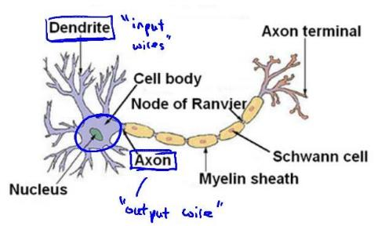
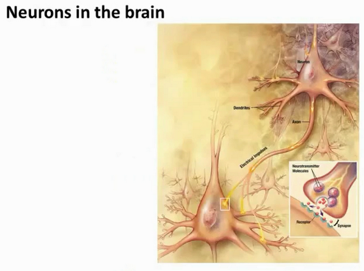

### 8.3 模型表示1

参考视频: 8 - 3 - Model Representation I (12 min).mkv

为了构建神经网络模型，我们需要首先思考大脑中的神经网络是怎样的？每一个神经元都可以被认为是一个处理单元/神经核（**processing unit**/**Nucleus**），它含有许多输入/树突（**input**/**Dendrite**），并且有一个输出/轴突（**output**/**Axon**）。神经网络是大量神经元相互链接并通过电脉冲来交流的一个网络。

下面是一组神经元的示意图，神经元利用微弱的电流进行沟通。这些弱电流也称作动作电位，其实就是一些微弱的电流。所以如果神经元想要传递一个消息，它就会就通过它的轴突，发送一段微弱电流给其他神经元，这就是轴突。

这里是一条连接到输入神经，或者连接另一个神经元树突的神经，接下来这个神经元接收这条消息，做一些计算，它有可能会反过来将在轴突上的自己的消息传给其他神经元。这就是所有人类思考的模型：我们的神经元把自己的收到的消息进行计算，并向其他神经元传递消息。这也是我们的感觉和肌肉运转的原理。如果你想活动一块肌肉，就会触发一个神经元给你的肌肉发送脉冲，并引起你的肌肉收缩。如果一些感官：比如说眼睛想要给大脑传递一个消息，那么它就像这样发送电脉冲给大脑的。

神经网络模型建立在很多神经元之上，每一个神经元又是一个个学习模型。这些神经元（也叫激活单元，**activation unit**）采纳一些特征作为输出，并且根据本身的模型提供一个输出。下图是一个以逻辑回归模型作为自身学习模型的神经元示例，在神经网络中，参数又可被成为权重（**weight**）。

我们设计出了类似于神经元的神经网络，效果如下：

其中$x_1$, $x_2$, $x_3$是输入单元（**input units**），我们将原始数据输入给它们。
$a_1$, $a_2$, $a_3$是中间单元，它们负责将数据进行处理，然后呈递到下一层。
最后是输出单元，它负责计算${h_\theta}\left( x \right)$。

神经网络模型是许多逻辑单元按照不同层级组织起来的网络，每一层的输出变量都是下一层的输入变量。下图为一个3层的神经网络，第一层成为输入层（**Input Layer**），最后一层称为输出层（**Output Layer**），中间一层成为隐藏层（**Hidden Layers**）。我们为每一层都增加一个偏差单位（**bias unit**）：

下面引入一些标记法来帮助描述模型：
$a_{i}^{\left( j \right)}$ 代表第$j$ 层的第 $i$ 个激活单元。${{\theta }^{\left( j \right)}}$代表从第 $j$ 层映射到第$ j+1$ 层时的权重的矩阵，例如${{\theta }^{\left( 1 \right)}}$代表从第一层映射到第二层的权重的矩阵。其尺寸为：以第 $j+1$层的激活单元数量为行数，以第 $j$ 层的激活单元数加一为列数的矩阵。例如：上图所示的神经网络中${{\theta }^{\left( 1 \right)}}$的尺寸为 3*4。

对于上图所示的模型，激活单元和输出分别表达为：

$a_{1}^{(2)}=g(\Theta _{10}^{(1)}{{x}_{0}}+\Theta _{11}^{(1)}{{x}_{1}}+\Theta _{12}^{(1)}{{x}_{2}}+\Theta _{13}^{(1)}{{x}_{3}})$
$a_{2}^{(2)}=g(\Theta _{20}^{(1)}{{x}_{0}}+\Theta _{21}^{(1)}{{x}_{1}}+\Theta _{22}^{(1)}{{x}_{2}}+\Theta _{23}^{(1)}{{x}_{3}})$
$a_{3}^{(2)}=g(\Theta _{30}^{(1)}{{x}_{0}}+\Theta _{31}^{(1)}{{x}_{1}}+\Theta _{32}^{(1)}{{x}_{2}}+\Theta _{33}^{(1)}{{x}_{3}})$
${{h}_{\Theta }}(x)=g(\Theta _{10}^{(2)}a_{0}^{(2)}+\Theta _{11}^{(2)}a_{1}^{(2)}+\Theta _{12}^{(2)}a_{2}^{(2)}+\Theta _{13}^{(2)}a_{3}^{(2)})$

上面进行的讨论中只是将特征矩阵中的一行（一个训练实例）喂给了神经网络，我们需要将整个训练集都喂给我们的神经网络算法来学习模型。

我们可以知道：每一个$a$都是由上一层所有的$x$和每一个$x$所对应的决定的。

（我们把这样从左到右的算法称为前向传播算法( **FORWARD PROPAGATION** )）

把$x$, $\theta$, $a$ 分别用矩阵表示：

我们可以得到$\theta \cdot X=a$ 。

