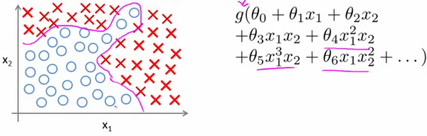

### 8.1 非线性假设

参考视频: 8 - 1 - Non-linear Hypotheses (10 min).mkv

我们之前学的，无论是线性回归还是逻辑回归都有这样一个缺点，即：当特征太多时，计算的负荷会非常大。

下面是一个例子：

当我们使用$x_1$, $x_2$ 的多次项式进行预测时，我们可以应用的很好。
之前我们已经看到过，使用非线性的多项式项，能够帮助我们建立更好的分类模型。假设我们有非常多的特征，例如大于100个变量，我们希望用这100个特征来构建一个非线性的多项式模型，结果将是数量非常惊人的特征组合，即便我们只采用两两特征的组合$(x_1x_2+x_1x_3+x_1x_4+...+x_2x_3+x_2x_4+...+x_{99}x_{100})$，我们也会有接近5000个组合而成的特征。这对于一般的逻辑回归来说需要计算的特征太多了。

假设我们希望训练一个模型来识别视觉对象（例如识别一张图片上是否是一辆汽车），我们怎样才能这么做呢？一种方法是我们利用很多汽车的图片和很多非汽车的图片，然后利用这些图片上一个个像素的值（饱和度或亮度）来作为特征。

假如我们只选用灰度图片，每个像素则只有一个值（而非 **RGB**值），我们可以选取图片上的两个不同位置上的两个像素，然后训练一个逻辑回归算法利用这两个像素的值来判断图片上是否是汽车：

假使我们采用的都是50x50像素的小图片，并且我们将所有的像素视为特征，则会有 2500个特征，如果我们要进一步将两两特征组合构成一个多项式模型，则会有约${{2500}^{2}}/2$个（接近3百万个）特征。普通的逻辑回归模型，不能有效地处理这么多的特征，这时候我们需要神经网络。

