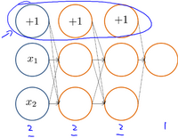
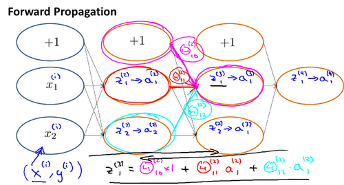

### 9.3 反向传播算法的直观理解

参考视频: 9 - 3 - Backpropagation Intuition (13 min).mkv

在上一段视频中，我们介绍了反向传播算法，对很多人来说，当第一次看到这种算法时，第一印象通常是，这个算法需要那么多繁杂的步骤，简直是太复杂了，实在不知道这些步骤，到底应该如何合在一起使用。就好像一个黑箱，里面充满了复杂的步骤。如果你对反向传播算法也有这种感受的话，这其实是正常的，相比于线性回归算法和逻辑回归算法而言，从数学的角度上讲，反向传播算法似乎并不简洁，对于反向传播这种算法，其实我已经使用了很多年了，但即便如此，即使是现在，我也经常感觉自己对反向传播算法的理解并不是十分深入，对于反向传播算法究竟是如何执行的，并没有一个很直观的理解。做过编程练习的同学应该可以感受到这些练习或多或少能帮助你，将这些复杂的步骤梳理了一遍，巩固了反向传播算法具体是如何实现的，这样你才能自己掌握这种算法。

在这段视频中，我想更加深入地讨论一下反向传播算法的这些复杂的步骤，并且希望给你一个更加全面直观的感受，理解这些步骤究竟是在做什么，也希望通过这段视频，你能理解，它至少还是一个合理的算法。但可能你即使看了这段视频，你还是觉得反向传播依然很复杂，依然像一个黑箱，太多复杂的步骤，依然感到有点神奇，这也是没关系的。即使是我接触反向传播这么多年了，有时候仍然觉得这是一个难以理解的算法，但还是希望这段视频能有些许帮助，为了更好地理解反向传播算法，我们再来仔细研究一下前向传播的原理：

前向传播算法：

反向传播算法做的是：

