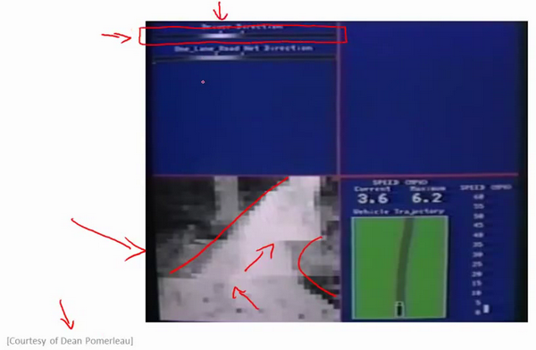
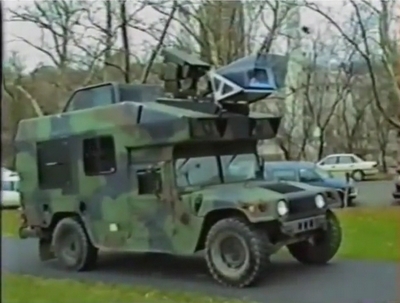

### 9.8 自主驾驶

参考视频: 9 - 8 - Autonomous Driving (7 min).mkv

在这段视频中，我想向你介绍一个具有历史意义的神经网络学习的重要例子。那就是使用神经网络来实现自动驾驶，也就是说使汽车通过学习来自己驾驶。接下来我将演示的这段视频是我从 Dean Pomerleau那里拿到的，他是我的同事，任职于美国东海岸的卡耐基梅隆大学。在这部分视频中，你就会明白可视化技术到底是什么？在看这段视频之前，我会告诉你可视化技术是什么。

在下面也就是左下方，就是汽车所看到的前方的路况图像。

在图中你依稀能看出一条道路，朝左延伸了一点，又向右了一点，然后上面的这幅图，你可以看到一条水平的菜单栏显示的是驾驶操作人选择的方向。就是这里的这条白亮的区段显示的就是人类驾驶者选择的方向。比如：最左边的区段，对应的操作就是向左急转，而最右端则对应向右急转的操作。因此，稍微靠左的区段，也就是中心稍微向左一点的位置，则表示在这一点上人类驾驶者的操作是慢慢的向左拐。

这幅图的第二部分对应的就是学习算法选出的行驶方向。并且，类似的，这一条白亮的区段显示的就是神经网络在这里选择的行驶方向，是稍微的左转，并且实际上在神经网络开始学习之前，你会看到网络的输出是一条灰色的区段，就像这样的一条灰色区段覆盖着整个区域这些均称的灰色区域，显示出神经网络已经随机初始化了，并且初始化时，我们并不知道汽车如何行驶，或者说我们并不知道所选行驶方向。只有在学习算法运行了足够长的时间之后，才会有这条白色的区段出现在整条灰色区域之中。显示出一个具体的行驶方向这就表示神经网络算法，在这时候已经选出了一个明确的行驶方向，不像刚开始的时候，输出一段模糊的浅灰色区域，而是输出一条白亮的区段，表示已经选出了明确的行驶方向。

**ALVINN** (**Autonomous Land Vehicle In a Neural Network**)是一个基于神经网络的智能系统，通过观察人类的驾驶来学习驾驶，**ALVINN**能够控制**NavLab**，装在一辆改装版军用悍马，这辆悍马装载了传感器、计算机和驱动器用来进行自动驾驶的导航试验。实现**ALVINN**功能的第一步，是对它进行训练，也就是训练一个人驾驶汽车。

然后让**ALVINN**观看，**ALVINN**每两秒将前方的路况图生成一张数字化图片，并且记录驾驶者的驾驶方向，得到的训练集图片被压缩为30x32像素，并且作为输入提供给**ALVINN**的三层神经网络，通过使用反向传播学习算法，**ALVINN**会训练得到一个与人类驾驶员操纵方向基本相近的结果。一开始，我们的网络选择出的方向是随机的，大约经过两分钟的训练后，我们的神经网络便能够准确地模拟人类驾驶者的驾驶方向，对其他道路类型，也重复进行这个训练过程，当网络被训练完成后，操作者就可按下运行按钮，车辆便开始行驶了。

每秒钟**ALVINN**生成12次数字化图片，并且将图像传送给神经网络进行训练，多个神经网络同时工作，每一个网络都生成一个行驶方向，以及一个预测自信度的参数，预测自信度最高的那个神经网络得到的行驶方向。比如这里，在这条单行道上训练出的网络将被最终用于控制车辆方向，车辆前方突然出现了一个交叉十字路口，当车辆到达这个十字路口时，我们单行道网络对应的自信度骤减，当它穿过这个十字路口时，前方的双车道将进入其视线，双车道网络的自信度便开始上升，当它的自信度上升时，双车道的网络，将被选择来控制行驶方向，车辆将被安全地引导进入双车道路。

这就是基于神经网络的自动驾驶技术。当然，我们还有很多更加先进的试验来实现自动驾驶技术。在美国，欧洲等一些国家和地区，他们提供了一些比这个方法更加稳定的驾驶控制技术。但我认为，使用这样一个简单的基于反向传播的神经网络，训练出如此强大的自动驾驶汽车，的确是一次令人惊讶的成就。

