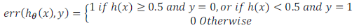

### 10.2 评估一个假设

参考视频: 10 - 2 - Evaluating a Hypothesis (8 min).mkv

​	在本节视频中我想介绍一下怎样用你学过的算法来评估假设函数。在之后的课程中，我们将以此为基础来讨论如何避免过拟合和欠拟合的问题。

​	当我们确定学习算法的参数的时候，我们考虑的是选择参量来使训练误差最小化，有人认为得到一个非常小的训练误差一定是一件好事，但我们已经知道，仅仅是因为这个假设具有很小的训练误差，并不能说明它就一定是一个好的假设函数。而且我们也学习了过拟合假设函数的例子，所以这推广到新的训练集上是不适用的。

​	那么，你该如何判断一个假设函数是过拟合的呢？对于这个简单的例子，我们可以对假设函数$h(x)$进行画图，然后观察图形趋势，但对于特征变量不止一个的这种一般情况，还有像有很多特征变量的问题，想要通过画出假设函数来进行观察，就会变得很难甚至是不可能实现。

​	因此，我们需要另一种方法来评估我们的假设函数过拟合检验。

​	为了检验算法是否过拟合，我们将数据分成训练集和测试集，通常用70%的数据作为训练集，用剩下30%的数据作为测试集。很重要的一点是训练集和测试集均要含有各种类型的数据，通常我们要对数据进行“洗牌”，然后再分成训练集和测试集。

​	测试集评估在通过训练集让我们的模型学习得出其参数后，对测试集运用该模型，我们有两种方式计算误差：

1. 对于线性回归模型，我们利用测试集数据计算代价函数$J$
2. 对于逻辑回归模型，我们除了可以利用测试数据集来计算代价函数外：

​                                   $$ J_{test}{(\theta)} = -\frac{1}{{m}_{test}}\sum_\limits{i=1}^{m_{test}}\log{h_{\theta}(x^{(i)}_{test})}+(1-{y^{(i)}_{test}})\log{h_{\theta}(x^{(i)}_{test})}$$

误分类的比率，对于每一个测试集实例，计算：

然后对计算结果求平均。

