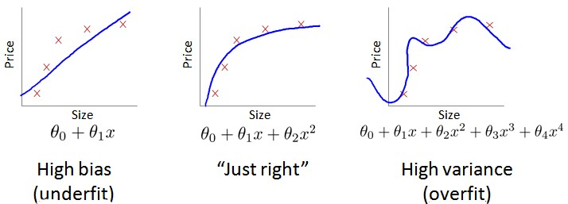

### 10.4 诊断偏差和方差

参考视频: 10 - 4 - Diagnosing Bias vs. Variance (8 min).mkv

​	当你运行一个学习算法时，如果这个算法的表现不理想，那么多半是出现两种情况：要么是偏差比较大，要么是方差比较大。换句话说，出现的情况要么是欠拟合，要么是过拟合问题。那么这两种情况，哪个和偏差有关，哪个和方差有关，或者是不是和两个都有关？搞清楚这一点非常重要，因为能判断出现的情况是这两种情况中的哪一种。其实是一个很有效的指示器，指引着可以改进算法的最有效的方法和途径。在这段视频中，我想更深入地探讨一下有关偏差和方差的问题，希望你能对它们有一个更深入的理解，并且也能弄清楚怎样评价一个学习算法，能够判断一个算法是偏差还是方差有问题，因为这个问题对于弄清如何改进学习算法的效果非常重要，高偏差和高方差的问题基本上来说是欠拟合和过拟合的问题。

​	我们通常会通过将训练集和交叉验证集的代价函数误差与多项式的次数绘制在同一张图表上来帮助分析：

**Bias/variance**

**Training error:**				               $J_{train}(\theta) = \frac{1}{2m}\sum_\limits{i=1}^{m}(h_{\theta}(x^{(i)})-y^{(i)})^2$

**Cross Validation error:**				$J_{cv}(\theta) = \frac{1}{2m_{cv}}\sum_\limits{i=1}^{m}(h_{\theta}(x^{(i)}_{cv})-y^{(i)}_{cv})^2$

​	对于训练集，当 $d$ 较小时，模型拟合程度更低，误差较大；随着 $d$ 的增长，拟合程度提高，误差减小。

​	对于交叉验证集，当 $d$ 较小时，模型拟合程度低，误差较大；但是随着 $d$ 的增长，误差呈现先减小后增大的趋势，转折点是我们的模型开始过拟合训练数据集的时候。

​	如果我们的交叉验证集误差较大，我们如何判断是方差还是偏差呢？根据上面的图表，我们知道:

​	训练集误差和交叉验证集误差近似时：偏差/欠拟合

​	交叉验证集误差远大于训练集误差时：方差/过拟合

