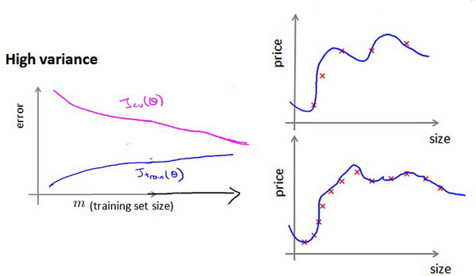

### 10.6 学习曲线

参考视频: 10 - 6 - Learning Curves (12 min).mkv

​	学习曲线就是一种很好的工具，我经常使用学习曲线来判断某一个学习算法是否处于偏差、方差问题。学习曲线是学习算法的一个很好的**合理检验**（**sanity check**）。学习曲线是将训练集误差和交叉验证集误差作为训练集实例数量（$m$）的函数绘制的图表。

​	即，如果我们有100行数据，我们从1行数据开始，逐渐学习更多行的数据。思想是：当训练较少行数据的时候，训练的模型将能够非常完美地适应较少的训练数据，但是训练出来的模型却不能很好地适应交叉验证集数据或测试集数据。

​	如何利用学习曲线识别高偏差/欠拟合：作为例子，我们尝试用一条直线来适应下面的数据，可以看出，无论训练集有多么大误差都不会有太大改观：

​	也就是说在高偏差/欠拟合的情况下，增加数据到训练集不一定能有帮助。

​	如何利用学习曲线识别高方差/过拟合：假设我们使用一个非常高次的多项式模型，并且正则化非常小，可以看出，当交叉验证集误差远大于训练集误差时，往训练集增加更多数据可以提高模型的效果。

​	也就是说在高方差/过拟合的情况下，增加更多数据到训练集可能可以提高算法效果。

