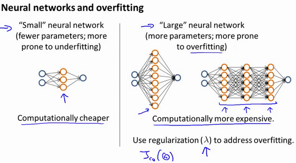

### 10.7 决定下一步做什么

参考视频: 10 - 7 - Deciding What to Do Next Revisited (7 min).mkv

​	我们已经介绍了怎样评价一个学习算法，我们讨论了模型选择问题，偏差和方差的问题。那么这些诊断法则怎样帮助我们判断，哪些方法可能有助于改进学习算法的效果，而哪些可能是徒劳的呢？

​	让我们再次回到最开始的例子，在那里寻找答案，这就是我们之前的例子。回顾 1.1 中提出的六种可选的下一步，让我们来看一看我们在什么情况下应该怎样选择：

1. 获得更多的训练实例——解决高方差

2. 尝试减少特征的数量——解决高方差

3. 尝试获得更多的特征——解决高偏差

4. 尝试增加多项式特征——解决高偏差

5. 尝试减少正则化程度λ——解决高偏差

6. 尝试增加正则化程度λ——解决高方差

神经网络的方差和偏差：

​	使用较小的神经网络，类似于参数较少的情况，容易导致高偏差和欠拟合，但计算代价较小使用较大的神经网络，类似于参数较多的情况，容易导致高方差和过拟合，虽然计算代价比较大，但是可以通过正则化手段来调整而更加适应数据。

​	通常选择较大的神经网络并采用正则化处理会比采用较小的神经网络效果要好。

​	对于神经网络中的隐藏层的层数的选择，通常从一层开始逐渐增加层数，为了更好地作选择，可以把数据分为训练集、交叉验证集和测试集，针对不同隐藏层层数的神经网络训练神经网络，
然后选择交叉验证集代价最小的神经网络。

​	好的，以上就是我们介绍的偏差和方差问题，以及诊断该问题的学习曲线方法。在改进学习算法的表现时，你可以充分运用以上这些内容来判断哪些途径可能是有帮助的。而哪些方法可能是无意义的。如果你理解了以上几节视频中介绍的内容，并且懂得如何运用。那么你已经可以使用机器学习方法有效的解决实际问题了。你也能像硅谷的大部分机器学习从业者一样，他们每天的工作就是使用这些学习算法来解决众多实际问题。我希望这几节中提到的一些技巧，关于方差、偏差，以及学习曲线为代表的诊断法能够真正帮助你更有效率地应用机器学习，让它们高效地工作。

