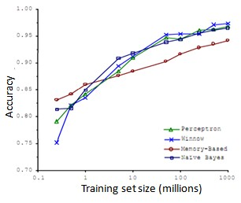

### 11.5 机器学习的数据

参考视频: 11 - 5 - Data For Machine Learning (11 min).mkv

​	在之前的视频中，我们讨论了评价指标。在这个视频中，我要稍微转换一下，讨论一下机器学习系统设计中另一个重要的方面，这往往涉及到用来训练的数据有多少。在之前的一些视频中，我曾告诫大家不要盲目地开始，而是花大量的时间来收集大量的数据，因为数据有时是唯一能实际起到作用的。但事实证明，在一定条件下，我会在这个视频里讲到这些条件是什么。得到大量的数据并在某种类型的学习算法中进行训练，可以是一种有效的方法来获得一个具有良好性能的学习算法。而这种情况往往出现在这些条件对于你的问题都成立。
并且你能够得到大量数据的情况下。这可以是一个很好的方式来获得非常高性能的学习算法。因此，在这段视频中，让我们一起讨论一下这个问题。

​	很多很多年前，我认识的两位研究人员**Michele Banko** 和**Eric Brill**进行了一项有趣的研究，他们尝试通过机器学习算法来区分常见的易混淆的单词，他们尝试了许多种不同的算法，并发现数据量非常大时，这些不同类型的算法效果都很好。

​	比如，在这样的句子中：早餐我吃了__个鸡蛋(**to**,**two**,**too**)，在这个例子中，“早餐我吃了2个鸡蛋”，这是一个易混淆的单词的例子。于是他们把诸如这样的机器学习问题，当做一类监督学习问题，并尝试将其分类，什么样的词，在一个英文句子特定的位置，才是合适的。他们用了几种不同的学习算法，这些算法都是在他们2001年进行研究的时候，都已经被公认是比较领先的。因此他们使用了一个方差，用于逻辑回归上的一个方差，被称作"感知器"(**perceptron**)。他们也采取了一些过去常用，但是现在比较少用的算法，比如 **Winnow**算法，很类似于回归问题，但在一些方面又有所不同，过去用得比较多，但现在用得不太多。还有一种基于内存的学习算法，现在也用得比较少了，但是我稍后会讨论一点，而且他们用了一个朴素算法。这些具体算法的细节不那么重要，我们下面希望探讨，什么时候我们会希望获得更多数据，而非修改算法。他们所做的就是改变了训练数据集的大小，并尝试将这些学习算法用于不同大小的训练数据集中，这就是他们得到的结果。

​	这些趋势非常明显，首先大部分算法，都具有相似的性能，其次，随着训练数据集的增大，在横轴上代表以百万为单位的训练集大小，从0.1个百万到1000百万，也就是到了10亿规模的训练集的样本，这些算法的性能也都对应地增强了。

​	事实上，如果你选择任意一个算法，可能是选择了一个"劣等的"算法，如果你给这个劣等算法更多的数据，那么从这些例子中看起来的话，它看上去很有可能会其他算法更好，甚至会比"优等算法"更好。由于这项原始的研究非常具有影响力，因此已经有一系列许多不同的研究显示了类似的结果。这些结果表明，许多不同的学习算法有时倾向于表现出非常相似的表现，这还取决于一些细节，但是真正能提高性能的，是你能够给一个算法大量的训练数据。像这样的结果，引起了一种在机器学习中的普遍共识："取得成功的人不是拥有最好算法的人，而是拥有最多数据的人"。

​	那么这种说法在什么时候是真，什么时候是假呢？因为如果我们有一个学习算法，并且如果这种说法是真的，那么得到大量的数据通常是保证我们具有一个高性能算法的最佳方式，而不是去争辩应该用什么样的算法。

​	假如有这样一些假设，在这些假设下有大量我们认为有用的训练集，我们假设在我们的机器学习问题中，特征值$x$包含了足够的信息，这些信息可以帮助我们用来准确地预测$y$，例如，如果我们采用了一些容易混淆的词，如：**two**、**to**、**too**，假如说它能够描述$x$，捕捉到需要填写的空白处周围的词语，那么特征捕捉到之后，我们就希望有对于“早饭我吃了__鸡蛋”，那么这就有大量的信息来告诉我中间我需要填的词是“两个”(**two**)，而不是单词 **to** 或**too**，因此特征捕捉，哪怕是周围词语中的一个词，就能够给我足够的信息来确定出标签 $y$是什么。换句话说，从这三组易混淆的词中，我应该选什么词来填空。

​	那么让我们来看一看，大量的数据是有帮助的情况。假设特征值有足够的信息来预测$y$值，假设我们使用一种需要大量参数的学习算法，比如有很多特征的逻辑回归或线性回归，或者用带有许多隐藏单元的神经网络，那又是另外一种带有很多参数的学习算法，这些都是非常强大的学习算法，它们有很多参数，这些参数可以拟合非常复杂的函数，因此我要调用这些，我将把这些算法想象成低偏差算法，因为我们能够拟合非常复杂的函数，而且因为我们有非常强大的学习算法，这些学习算法能够拟合非常复杂的函数。很有可能，如果我们用这些数据运行这些算法，这种算法能很好地拟合训练集，因此，训练误差就会很低了。

​	现在假设我们使用了非常非常大的训练集，在这种情况下，尽管我们希望有很多参数，但是如果训练集比参数的数量还大，甚至是更多，那么这些算法就不太可能会过度拟合。也就是说训练误差有希望接近测试误差。

​	另一种考虑这个问题的角度是为了有一个高性能的学习算法，我们希望它不要有高的偏差和方差。

​	因此偏差问题，我么将通过确保有一个具有很多参数的学习算法来解决，以便我们能够得到一个较低偏差的算法，并且通过用非常大的训练集来保证。

​	我们在此没有方差问题，我们的算法将没有方差，并且通过将这两个值放在一起，我们最终可以得到一个低误差和低方差的学习算法。这使得我们能够很好地测试测试数据集。从根本上来说，这是一个关键的假设：特征值有足够的信息量，且我们有一类很好的函数，这是为什么能保证低误差的关键所在。它有大量的训练数据集，这能保证得到更多的方差值，因此这给我们提出了一些可能的条件，如果你有大量的数据，而且你训练了一种带有很多参数的学习算法，那么这将会是一个很好的方式，来提供一个高性能的学习算法。

​	我觉得关键的测试：首先，一个人类专家看到了特征值 $x$，能很有信心的预测出$y$值吗？因为这可以证明 $ y$ 可以根据特征值$x$被准确地预测出来。其次，我们实际上能得到一组庞大的训练集，并且在这个训练集中训练一个有很多参数的学习算法吗？如果你不能做到这两者，那么更多时候，你会得到一个性能很好的学习算法。

