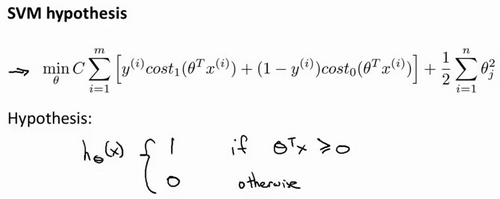

### 12.1 优化目标

参考视频: 12 - 1 - Optimization Objective (15 min).mkv

到目前为止,你已经见过一系列不同的学习算法。在监督学习中，许多学习算法的性能都非常类似，因此，重要的不是你该选择使用学习算法**A**还是学习算法**B**，而更重要的是，应用这些算法时，所创建的大量数据在应用这些算法时，表现情况通常依赖于你的水平。比如：你为学习算法所设计的特征量的选择，以及如何选择正则化参数，诸如此类的事。还有一个更加强大的算法广泛的应用于工业界和学术界，它被称为支持向量机(**Support Vector Machine**)。与逻辑回归和神经网络相比，支持向量机，或者简称**SVM**，在学习复杂的非线性方程时提供了一种更为清晰，更加强大的方式。因此，在接下来的视频中，我会探讨这一算法。在稍后的课程中，我也会对监督学习算法进行简要的总结。当然，仅仅是作简要描述。但对于支持向量机，鉴于该算法的强大和受欢迎度，在本课中，我会花许多时间来讲解它。它也是我们所介绍的最后一个监督学习算法。

正如我们之前开发的学习算法，我们从优化目标开始。那么，我们开始学习这个算法。为了描述支持向量机，事实上，我将会从逻辑回归开始展示我们如何一点一点修改来得到本质上的支持向量机。

那么，在逻辑回归中我们已经熟悉了这里的假设函数形式，和右边的S型激励函数。然而，为了解释一些数学知识.我将用$z$ 表示$\theta^Tx$。

现在考虑下我们想要逻辑回归做什么：如果有一个 $y=1$的样本，我的意思是不管是在训练集中或是在测试集中，又或者在交叉验证集中，总之是 $y=1$，现在我们希望${{h}_{\theta }}\left( x \right)$ 趋近1。因为我们想要正确地将此样本分类，这就意味着当 ${{h}_{\theta }}\left( x \right)$趋近于1时，$\theta^Tx$ 应当远大于0，这里的$>>$意思是远远大于0。这是因为由于 $z$ 表示 $\theta^Tx$，当 $z$远大于0时，即到了该图的右边，你不难发现此时逻辑回归的输出将趋近于1。相反地，如果我们有另一个样本，即$y=0$。我们希望假设函数的输出值将趋近于0，这对应于$\theta^Tx$，或者就是 $z$ 会远小于0，因为对应的假设函数的输出值趋近0。

如果你进一步观察逻辑回归的代价函数，你会发现每个样本 $(x,y)$都会为总代价函数，增加这里的一项，因此，对于总代价函数通常会有对所有的训练样本求和，并且这里还有一个$1/m$项，但是，在逻辑回归中，这里的这一项就是表示一个训练样本所对应的表达式。现在，如果我将完整定义的假设函数代入这里。那么，我们就会得到每一个训练样本都影响这一项。

现在，先忽略 $1/m$ 这一项，但是这一项是影响整个总代价函数中的这一项的。

现在，一起来考虑两种情况：

一种是$y$等于1的情况；另一种是 $y$ 等于0的情况。

在第一种情况中，假设 $y=1$ ，此时在目标函数中只需有第一项起作用，因为$y=1$时，$(1-y)$项将等于0。因此，当在 $y=1$ 的样本中时，即在 $(x, y) $中 ，我们得到 $y=1$ $-\log(1-\frac{1}{1+e^{-z}})$这样一项，这里同上一张幻灯片一致。

我用 $z$ 表示$\theta^Tx$，即： $z= \theta^Tx$。当然，在代价函数中，$y$ 前面有负号。我们只是这样表示，如果 $y=1$ 代价函数中，这一项也等于1。这样做是为了简化此处的表达式。如果画出关于$z$ 的函数，你会看到左下角的这条曲线，我们同样可以看到，当$z$ 增大时，也就是相当于$\theta^Tx$增大时，$z$ 对应的值会变的非常小。对整个代价函数而言，影响也非常小。这也就解释了，为什么逻辑回归在观察到正样本$y=1$时，试图将$\theta^Tx$设置得非常大。因为，在代价函数中的这一项会变的非常小。

现在开始建立支持向量机，我们从这里开始：

我们会从这个代价函数开始，也就是$-\log(1-\frac{1}{1+e^{-z}})$一点一点修改，让我取这里的$z=1$ 点，我先画出将要用的代价函数。

新的代价函数将会水平的从这里到右边(图外)，然后我再画一条同逻辑回归非常相似的直线，但是，在这里是一条直线，也就是我用紫红色画的曲线，就是这条紫红色的曲线。那么，到了这里已经非常接近逻辑回归中使用的代价函数了。只是这里是由两条线段组成，即位于右边的水平部分和位于左边的直线部分，先别过多的考虑左边直线部分的斜率，这并不是很重要。但是，这里我们将使用的新的代价函数，是在$y=1$的前提下的。你也许能想到，这应该能做同逻辑回归中类似的事情，但事实上，在之后的优化问题中，这会变得更坚定，并且为支持向量机，带来计算上的优势。例如，更容易计算股票交易的问题等等。

目前，我们只是讨论了$y=1$的情况，另外一种情况是当$y=0$时，此时如果你仔细观察代价函数只留下了第二项，因为第一项被消除了。如果当$y=0$时，那么这一项也就是0了。所以上述表达式只留下了第二项。因此，这个样本的代价或是代价函数的贡献。将会由这一项表示。并且，如果你将这一项作为$z$的函数，那么，这里就会得到横轴$z$。现在，你完成了支持向量机中的部分内容，同样地，我们要替代这一条蓝色的线，用相似的方法。

如果我们用一个新的代价函数来代替，即这条从0点开始的水平直线，然后是一条斜线，像上图。那么，现在让我给这两个方程命名，左边的函数，我称之为${\cos}t_1{(z)}$，同时，右边函数我称它为${\cos}t_0{(z)}$。这里的下标是指在代价函数中，对应的 $y=1$ 和 $y=0$ 的情况，拥有了这些定义后，现在，我们就开始构建支持向量机。

这是我们在逻辑回归中使用代价函数$J(\theta)$。也许这个方程看起来不是非常熟悉。这是因为之前有个负号在方程外面，但是，这里我所做的是，将负号移到了表达式的里面，这样做使得方程看起来有些不同。对于支持向量机而言，实质上我们要将这替换为${\cos}t_1{(z)}$，也就是${\cos}t_1{(\theta^Tx)}$，同样地，我也将这一项替换为${\cos}t_0{(z)}$，也就是代价${\cos}t_0{(\theta^Tx)}$。这里的代价函数${\cos}t_1$，就是之前所提到的那条线。此外，代价函数${\cos}t_0$，也是上面所介绍过的那条线。因此，对于支持向量机，我们得到了这里的最小化问题，即:

然后，再加上正则化参数。现在，按照支持向量机的惯例，事实上，我们的书写会稍微有些不同，代价函数的参数表示也会稍微有些不同。

首先，我们要除去$1/m$这一项，当然，这仅仅是由于人们使用支持向量机时，对比于逻辑回归而言，不同的习惯所致，但这里我所说的意思是：你知道，我将要做的是仅仅除去$1/m$这一项，但是，这也会得出同样的 ${{\theta }}$ 最优值，好的，因为$1/m$ 仅是个常量，因此，你知道在这个最小化问题中，无论前面是否有$1/m$ 这一项，最终我所得到的最优值${{\theta }}$都是一样的。这里我的意思是，先给你举一个实例，假定有一最小化问题：即要求当$(u-5)^2+1$取得最小值时的$u$值，这时最小值为：当$u=5$时取得最小值。

现在，如果我们想要将这个目标函数乘上常数10，这里我的最小化问题就变成了：求使得$10×(u-5)^2+10$最小的值$u$，然而，使得这里最小的$u$值仍为5。因此将一些常数乘以你的最小化项，这并不会改变最小化该方程时得到$u$值。因此，这里我所做的是删去常量$m$。也相同的，我将目标函数乘上一个常量$m$，并不会改变取得最小值时的${{\theta }}$值。

第二点概念上的变化，我们只是指在使用支持向量机时，一些如下的标准惯例，而不是逻辑回归。因此，对于逻辑回归，在目标函数中，我们有两项：第一个是训练样本的代价，第二个是我们的正则化项，我们不得不去用这一项来平衡。这就相当于我们想要最小化$A$加上正则化参数$\lambda$，然后乘以其他项$B$对吧？这里的$A$表示这里的第一项，同时我用**B**表示第二项，但不包括$\lambda$，我们不是优化这里的$A+\lambda\times B$。我们所做的是通过设置不同正则参数$\lambda$达到优化目的。这样，我们就能够权衡对应的项，是使得训练样本拟合的更好。即最小化$A$。还是保证正则参数足够小，也即是对于**B**项而言，但对于支持向量机，按照惯例，我们将使用一个不同的参数替换这里使用的$\lambda$来权衡这两项。你知道，就是第一项和第二项我们依照惯例使用一个不同的参数称为$C$，同时改为优化目标，$C×A+B$因此，在逻辑回归中，如果给定$\lambda$，一个非常大的值，意味着给予B更大的权重。而这里，就对应于将$C$ 设定为非常小的值，那么，相应的将会给$B$比给$A$更大的权重。因此，这只是一种不同的方式来控制这种权衡或者一种不同的方法，即用参数来决定是更关心第一项的优化，还是更关心第二项的优化。当然你也可以把这里的参数$C$ 考虑成$1/\lambda$，同 $1/\lambda$所扮演的角色相同，并且这两个方程或这两个表达式并不相同，因为$C=1/\lambda$，但是也并不全是这样，如果当$C=1/\lambda$时，这两个优化目标应当得到相同的值，相同的最优值 ${{\theta }}$。因此，就用它们来代替。那么，我现在删掉这里的$\lambda$，并且用常数$C$来代替。因此，这就得到了在支持向量机中我们的整个优化目标函数。然后最小化这个目标函数，得到**SVM** 学习到的参数$C$。

最后有别于逻辑回归输出的概率。在这里，我们的代价函数，当最小化代价函数，获得参数${{\theta }}$时，支持向量机所做的是它来直接预测$y$的值等于1，还是等于0。因此，这个假设函数会预测1。当$\theta^Tx$大于或者等于0时，或者等于0时，所以学习参数${{\theta }}$就是支持向量机假设函数的形式。那么，这就是支持向量机数学上的定义。

在接下来的视频中，让我们再回去从直观的角度看看优化目标，实际上是在做什么，以及SVM的假设函数将会学习什么，同时也会谈谈如何做些许修改，学习更加复杂、非线性的函数。

