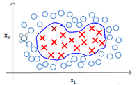
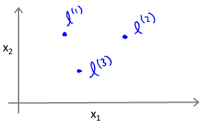

### 12.4 核函数1

参考视频: 12 - 4 - Kernels I (16 min).mkv

回顾我们之前讨论过可以使用高级数的多项式模型来解决无法用直线进行分隔的分类问题：

为了获得上图所示的判定边界，我们的模型可能是${{\theta }_{0}}+{{\theta }_{1}}{{x}_{1}}+{{\theta }_{2}}{{x}_{2}}+{{\theta }_{3}}{{x}_{1}}{{x}_{2}}+{{\theta }_{4}}x_{1}^{2}+{{\theta }_{5}}x_{2}^{2}+\cdots $的形式。

我们可以用一系列的新的特征f来替换模型中的每一项。例如令：
${{f}_{1}}={{x}_{1}},{{f}_{2}}={{x}_{2}},{{f}_{3}}={{x}_{1}}{{x}_{2}},{{f}_{4}}=x_{1}^{2},{{f}_{5}}=x_{2}^{2}$

...得到$h_θ(x)=f_1+f_2+...+f_n$。然而，除了对原有的特征进行组合以外，有没有更好的方法来构造$f_1,f_2,f_3$？我们可以利用核函数来计算出新的特征。

给定一个训练实例$x$，我们利用$x$的各个特征与我们预先选定的**地标**(**landmarks**)$l^{(1)},l^{(2)},l^{(3)}$的近似程度来选取新的特征$f_1,f_2,f_3$。

例如：${{f}_{1}}=similarity(x,{{l}^{(1)}})=e(-\frac{{{\left\| x-{{l}^{(1)}} \right\|}^{2}}}{2{{\sigma }^{2}}})$

其中：${{\left\| x-{{l}^{(1)}} \right\|}^{2}}=\sum{_{j=1}^{n}}{{({{x}_{j}}-l_{j}^{(1)})}^{2}}$，为实例$x$中所有特征与地标$l^{(1)}$之间的距离的和。上例中的$similarity(x,{{l}^{(1)}})$就是核函数，具体而言，这里是一个**高斯核函数**(**Gaussian Kernel**)。 **注：这个函数与正态分布没什么实际上的关系，只是看上去像而已。**

这些地标的作用是什么？如果一个训练实例$x$与地标$L$之间的距离近似于0，则新特征 $f$近似于$e^{-0}=1$，如果训练实例$x$与地标$L$之间距离较远，则$f$近似于$e^{-(一个较大的数)}=0$。

假设我们的训练实例含有两个特征[$x_{1}$ $x{_2}$]，给定地标$l^{(1)}$与不同的$\sigma$值，见下图：

图中水平面的坐标为 $x_{1}$，$x_{2}$而垂直坐标轴代表$f$。可以看出，只有当$x$与$l^{(1)}$重合时$f$才具有最大值。随着$x$的改变$f$值改变的速率受到$\sigma^2$的控制。

在下图中，当实例处于洋红色的点位置处，因为其离$l^{(1)}$更近，但是离$l^{(2)}$和$l^{(3)}$较远，因此$f_1$接近1，而$f_2$,$f_3$接近0。因此$h_θ(x)=θ_0+θ_1f_1+θ_2f_2+θ_1f_3>0$，因此预测$y=1$。同理可以求出，对于离$l^{(2)}$较近的绿色点，也预测$y=1$，但是对于蓝绿色的点，因为其离三个地标都较远，预测$y=0$。

这样，图中红色的封闭曲线所表示的范围，便是我们依据一个单一的训练实例和我们选取的地标所得出的判定边界，在预测时，我们采用的特征不是训练实例本身的特征，而是通过核函数计算出的新特征$f_1,f_2,f_3$。

