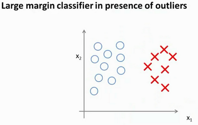

### 12.2 大边界的直观理解

参考视频: 12 - 2 - Large Margin Intuition (11 min).mkv

人们有时将支持向量机看作是大间距分类器。在这一部分，我将介绍其中的含义，这有助于我们直观理解**SVM**模型的假设是什么样的。

这是我的支持向量机模型的代价函数，在左边这里我画出了关于z的代价函数${\cos}t_1{(z)}$，此函数用于正样本，而在右边这里我画出了关于$z$的代价函数${\cos}t_0{(z)}$，横轴表示$z$，现在让我们考虑一下，最小化这些代价函数的必要条件是什么。如果你有一个正样本，$y=1$，则只有在$z>=1$时，代价函数${\cos}t_1{(z)}$才等于0。

换句话说，如果你有一个正样本，我们会希望$\theta^Tx$>=1，反之，如果$y=0$，我们观察一下，函数${\cos}t_0{(z)}$，它只有在$z<=1$的区间里函数值为0。这是支持向量机的一个有趣性质。事实上，如果你有一个正样本$y=1$，则其实我们仅仅要求$\theta^Tx$大于等于0，就能将该样本恰当分出，这是因为如果$\theta^Tx$\>0大的话，我们的模型代价函数值为0，类似地，如果你有一个负样本，则仅需要$\theta^Tx$\<=0就会将负例正确分离，但是，支持向量机的要求更高，不仅仅要能正确分开输入的样本，即不仅仅要求$\theta^Tx$\>0，我们需要的是比0值大很多，比如大于等于1，我也想这个比0小很多，比如我希望它小于等于-1，这就相当于在支持向量机中嵌入了一个额外的安全因子，或者说安全的间距因子。

当然，逻辑回归做了类似的事情。但是让我们看一下，在支持向量机中，这个因子会导致什么结果。具体而言，我接下来会考虑一个特例。我们将这个常数$C$设置成一个非常大的值。比如我们假设$C$的值为100000或者其它非常大的数，然后来观察支持向量机会给出什么结果？

如果 $C$非常大，则最小化代价函数的时候，我们将会很希望找到一个使第一项为0的最优解。因此，让我们尝试在代价项的第一项为0的情形下理解该优化问题。比如我们可以把$C$设置成了非常大的常数，这将给我们一些关于支持向量机模型的直观感受。

​				$$\min_\limits{\theta}C\sum_\limits{i=1}^{m}\left[y^{(i)}{\cos}t_{1}\left(\theta^{T}x^{(i)}\right)+\left(1-y^{(i)}\right){\cos}t\left(\theta^{T}x^{(i)}\right)\right]+\frac{1}{2}\sum_\limits{i=1}^{n}\theta^{2}_{j}$$

我们已经看到输入一个训练样本标签为$y=1$，你想令第一项为0，你需要做的是找到一个${{\theta }}$，使得$\theta^Tx>=1$，类似地，对于一个训练样本，标签为$y=0$，为了使${\cos}t_0{(z)}$ 函数的值为0，我们需要$\theta^Tx<=-1$。因此，现在考虑我们的优化问题。选择参数，使得第一项等于0，就会导致下面的优化问题，因为我们将选择参数使第一项为0，因此这个函数的第一项为0，因此是$C$乘以0加上二分之一乘以第二项。这里第一项是$C$乘以0，因此可以将其删去，因为我知道它是0。

这将遵从以下的约束：$\theta^Tx^{(i)}>=1$，如果 $y^{(i)}$是等于1 的，$\theta^Tx^{(i)}<=-1$，如果样本$i$是一个负样本，这样当你求解这个优化问题的时候，当你最小化这个关于变量${{\theta }}$的函数的时候，你会得到一个非常有趣的决策边界。

具体而言，如果你考察这样一个数据集，其中有正样本，也有负样本，可以看到这个数据集是线性可分的。我的意思是，存在一条直线把正负样本分开。当然有多条不同的直线，可以把正样本和负样本完全分开。

比如，这就是一个决策边界可以把正样本和负样本分开。但是多多少少这个看起来并不是非常自然是么?

或者我们可以画一条更差的决策界，这是另一条决策边界，可以将正样本和负样本分开，但仅仅是勉强分开，这些决策边界看起来都不是特别好的选择，支持向量机将会选择这个黑色的决策边界，相较于之前我用粉色或者绿色画的决策界。这条黑色的看起来好得多，黑线看起来是更稳健的决策界。在分离正样本和负样本上它显得的更好。数学上来讲，这是什么意思呢？这条黑线有更大的距离，这个距离叫做间距(**margin**)。

当画出这两条额外的蓝线，我们看到黑色的决策界和训练样本之间有更大的最短距离。然而粉线和蓝线离训练样本就非常近，在分离样本的时候就会比黑线表现差。因此，这个距离叫做支持向量机的间距，而这是支持向量机具有鲁棒性的原因，因为它努力用一个最大间距来分离样本。因此支持向量机有时被称为**大间距分类器**，而这其实是求解上一页幻灯片上优化问题的结果。

我知道你也许想知道求解上一页幻灯片中的优化问题为什么会产生这个结果？它是如何产生这个大间距分类器的呢？我知道我还没有解释这一点。

我将会从直观上略述为什么这个优化问题会产生大间距分类器。总之这个图示有助于你理解支持向量机模型的做法，即努力将正样本和负样本用最大的间距分开。

在本节课中关于大间距分类器，我想讲最后一点：我们将这个大间距分类器中的正则化因子常数$C$设置的非常大，我记得我将其设置为了100000，因此对这样的一个数据集，也许我们将选择这样的决策界，从而最大间距地分离开正样本和负样本。那么在让代价函数最小化的过程中，我们希望找出在$y=1$和$y=0$两种情况下都使得代价函数中左边的这一项尽量为零的参数。如果我们找到了这样的参数，则我们的最小化问题便转变成：

事实上，支持向量机现在要比这个大间距分类器所体现得更成熟，尤其是当你使用大间距分类器的时候，你的学习算法会受异常点(outlier) 的影响。比如我们加入一个额外的正样本。

在这里，如果你加了这个样本，为了将样本用最大间距分开，也许我最终会得到一条类似这样的决策界，对么？就是这条粉色的线，仅仅基于一个异常值，仅仅基于一个样本，就将我的决策界从这条黑线变到这条粉线，这实在是不明智的。而如果正则化参数$C$，设置的非常大，这事实上正是支持向量机将会做的。它将决策界，从黑线变到了粉线，但是如果$C$ 设置的小一点，**如果你将C设置的不要太大，则你最终会得到这条黑线，**当然数据如果不是线性可分的，如果你在这里有一些正样本或者你在这里有一些负样本，则支持向量机也会将它们恰当分开。因此，大间距分类器的描述，仅仅是从直观上给出了正则化参数$C$非常大的情形，同时，要提醒你$C$的作用类似于$1/\lambda$，$\lambda$是我们之前使用过的正则化参数。这只是$C$非常大的情形，或者等价地 $\lambda$ 非常小的情形。你最终会得到类似粉线这样的决策界，但是实际上应用支持向量机的时候，**当$C$不是非常非常大的时候，它可以忽略掉一些异常点的影响，得到更好的决策界。**甚至当你的数据不是线性可分的时候，支持向量机也可以给出好的结果。

回顾 $C=1/\lambda$，因此：

$C$ 较大时，相当于 $\lambda$ 较小，可能会导致过拟合，高方差。

$C$ 较小时，相当于$\lambda$较大，可能会导致低拟合，高偏差。

我们稍后会介绍支持向量机的偏差和方差，希望在那时候关于如何处理参数的这种平衡会变得更加清晰。我希望，这节课给出了一些关于为什么支持向量机被看做大间距分类器的直观理解。它用最大间距将样本区分开，尽管从技术上讲，这只有当参数$C$是非常大的时候是真的，但是它对于理解支持向量机是有益的。

本节课中我们略去了一步，那就是我们在幻灯片中给出的优化问题。为什么会是这样的？它是如何得出大间距分类器的？我在本节中没有讲解，在下一节课中，我将略述这些问题背后的数学原理，来解释这个优化问题是如何得到一个大间距分类器的。

