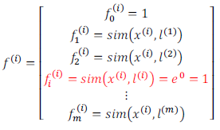

### 12.5 核函数2

参考视频: 12 - 5 - Kernels II (16 min).mkv

在上一节视频里，我们讨论了核函数这个想法，以及怎样利用它去实现支持向量机的一些新特性。在这一节视频中，我将补充一些缺失的细节，并简单的介绍一下怎么在实际中使用应用这些想法。

如何选择地标？

我们通常是根据训练集的数量选择地标的数量，即如果训练集中有$m$个实例，则我们选取$m$个地标，并且令:$l^{(1)}=x^{(1)},l^{(2)}=x^{(2)},.....,l^{(m)}=x^{(m)}$。这样做的好处在于：现在我们得到的新特征是建立在原有特征与训练集中所有其他特征之间距离的基础之上的，即：

下面我们将核函数运用到支持向量机中，修改我们的支持向量机假设为：

• 给定$x$，计算新特征$f$，当$θ^Tf>=0$ 时，预测 $y=1$，否则反之。 

相应地修改代价函数为：$\sum{_{j=1}^{n=m}}\theta _{j}^{2}={{\theta}^{T}}\theta $，

$min C\sum\limits_{i=1}^{m}{[{{y}^{(i)}}cos {{t}_{1}}}( {{\theta }^{T}}{{f}^{(i)}})+(1-{{y}^{(i)}})cos {{t}_{0}}( {{\theta }^{T}}{{f}^{(i)}})]+\frac{1}{2}\sum\limits_{j=1}^{n=m}{\theta _{j}^{2}}$
在具体实施过程中，我们还需要对最后的正则化项进行些微调整，在计算$\sum{_{j=1}^{n=m}}\theta _{j}^{2}={{\theta}^{T}}\theta $时，我们用$θ^TMθ$代替$θ^Tθ$，其中$M$是根据我们选择的核函数而不同的一个矩阵。这样做的原因是为了简化计算。

理论上讲，我们也可以在逻辑回归中使用核函数，但是上面使用 $M$来简化计算的方法不适用与逻辑回归，因此计算将非常耗费时间。

在此，我们不介绍最小化支持向量机的代价函数的方法，你可以使用现有的软件包（如**liblinear**,**libsvm**等）。在使用这些软件包最小化我们的代价函数之前，我们通常需要编写核函数，并且如果我们使用高斯核函数，那么在使用之前进行特征缩放是非常必要的。

另外，支持向量机也可以不使用核函数，不使用核函数又称为**线性核函数**(**linear kernel**)，当我们不采用非常复杂的函数，或者我们的训练集特征非常多而实例非常少的时候，可以采用这种不带核函数的支持向量机。

下面是支持向量机的两个参数$C$和$\sigma$的影响：

$C=1/\lambda$

$C$ 较大时，相当于$\lambda$较小，可能会导致过拟合，高方差；

$C$ 较小时，相当于$λ$较大，可能会导致低拟合，高偏差；

$\sigma$较大时，可能会导致低方差，高偏差；

$\sigma$较小时，可能会导致低偏差，高方差。

如果你看了本周的编程作业，你就能亲自实现这些想法，并亲眼看到这些效果。这就是利用核函数的支持向量机算法，希望这些关于偏差和方差的讨论，能给你一些对于算法结果预期的直观印象。

