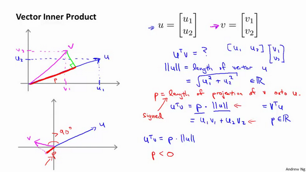
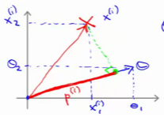

### 12.3 数学背后的大边界分类（选修）

参考视频: 12 - 3 - Mathematics Behind Large Margin Classification (Optional) (20 min).mkv

在本节课中，我将介绍一些大间隔分类背后的数学原理。本节为选学部分，你完全可以跳过它，但是听听这节课可能让你对支持向量机中的优化问题，以及如何得到大间距分类器，产生更好的直观理解。

首先，让我来给大家复习一下关于向量内积的知识。假设我有两个向量，$u$和$v$，我将它们写在这里。两个都是二维向量，我们看一下，$u^T v$的结果。$u^T v$也叫做向量$u$和$v$之间的内积。由于是二维向量，我可以将它们画在这个图上。我们说，这就是向量$u$即在横轴上，取值为某个${{u}_{1}}$，而在纵轴上，高度是某个${{u}_{2}}$作为$u$的第二个分量。现在，很容易计算的一个量就是向量$u$的范数。$\left\| u \right\|$表示$u$的范数，即$u$的长度，即向量$u$的欧几里得长度。根据毕达哥拉斯定理，$\left\| u \right\|=\sqrt{u_{1}^{2}+u_{2}^{2}}$，这是向量$u$的长度，它是一个实数。现在你知道了这个的长度是多少了。我刚刚画的这个向量的长度就知道了。

现在让我们回头来看向量$v$ ，因为我们想计算内积。$v$是另一个向量，它的两个分量${{v}_{1}}$和${{v}_{2}}$是已知的。向量$v$可以画在这里，现在让我们来看看如何计算$u$和$v$之间的内积。这就是具体做法，我们将向量$v$投影到向量$u$上，我们做一个直角投影，或者说一个90度投影将其投影到$u$上，接下来我度量这条红线的长度。我称这条红线的长度为$p$，因此$p$就是长度，或者说是向量$v$投影到向量$u$上的量，我将它写下来，$p$是$v$投影到向量$u$上的长度，因此可以将${{u}^{T}}v=p\centerdot \left\| u \right\|$，或者说$u$的长度。这是计算内积的一种方法。如果你从几何上画出p的值，同时画出$u$的范数，你也会同样地计算出内积，答案是一样的。另一个计算公式是：$u^T v$就是$\left[ {{u}_{1}}\text{ }{{u}_{2}} \right]$ 这个一行两列的矩阵乘以$v$。因此可以得到${{u}_{1}}\times {{v}_{1}}+{{u}_{2}}\times {{v}_{2}}$。根据线性代数的知识，这两个公式会给出同样的结果。顺便说一句，$u^Tv=v^Tu$。因此如果你将$u$和$v$交换位置，将$u$投影到$v$上，而不是将$v$投影到$u$上，然后做同样地计算，只是把$u$和$v$的位置交换一下，你事实上可以得到同样的结果。申明一点，在这个等式中$u$的范数是一个实数，$p$也是一个实数，因此$u^T v$就是两个实数正常相乘。

最后一点，需要注意的就是$p$值，$p$事实上是有符号的，即它可能是正值，也可能是负值。我的意思是说，如果$u$是一个类似这样的向量，$v$是一个类似这样的向量，$u$和$v$之间的夹角大于90度，则如果将$v$投影到$u$上，会得到这样的一个投影，这是$p$的长度，在这个情形下我们仍然有${{u}^{T}}v$是等于$p$乘以$u$的范数。唯一一点不同的是$p$在这里是负的。在内积计算中，如果$u$和$v$之间的夹角小于90度，那么那条红线的长度$p$是正值。然而如果这个夹角大于90度，则$p$将会是负的。就是这个小线段的长度是负的。如果它们之间的夹角大于90度，两个向量之间的内积也是负的。这就是关于向量内积的知识。我们接下来将会使用这些关于向量内积的性质试图来理解支持向量机中的目标函数。

这就是我们先前给出的支持向量机模型中的目标函数。为了讲解方便，我做一点简化，仅仅是为了让目标函数更容易被分析。

我接下来忽略掉截距，令${{\theta }_{0}}=0$，这样更容易画示意图。我将特征数$n$置为2，因此我们仅有两个特征${{x}_{1}},{{x}_{2}}$，现在我们来看一下目标函数，支持向量机的优化目标函数。当我们仅有两个特征，即$n=2$时，这个式子可以写作：$\frac{1}{2}\left({\theta_1^2+\theta_2^2}\right)=\frac{1}{2}\left(\sqrt{\theta_1^2+\theta_2^2}\right)^2$，我们只有两个参数${{\theta }_{1}},{{\theta }_{2}}$。你可能注意到括号里面的这一项是向量${{\theta }}$的范数，或者说是向量${{\theta }}$的长度。我的意思是如果我们将向量${{\theta }}$写出来，那么我刚刚画红线的这一项就是向量${{\theta }}$的长度或范数。这里我们用的是之前学过的向量范数的定义，事实上这就等于向量${{\theta }}$的长度。

当然你可以将其写作${{\theta }_{0}}\text{,}{{\theta }_{1}},{{\theta }_{2}}$，如果${{\theta }_{0}}=0$，那就是${{\theta }_{1}},{{\theta }_{2}}$的长度。在这里我将忽略${{\theta }_{0}}$，这样来写$\theta$的范数，它仅仅和${{\theta }_{1}},{{\theta }_{2}}$有关。但是，数学上不管你是否包含，其实并没有差别，因此在我们接下来的推导中去掉${{\theta }_{0}}$不会有影响这意味着我们的目标函数是等于$\frac{1}{2}\left\| \theta \right\|^2$。因此支持向量机做的全部事情，就是**极小化参数向量**${{\theta }}$**范数的平方，或者说长度的平方**。

现在我将要看看这些项：$\theta^{T}x$更深入地理解它们的含义。给定参数向量$\theta $给定一个样本$x$，这等于什么呢?在前一页幻灯片上，我们画出了在不同情形下，$u^Tv$的示意图，我们将会使用这些概念，$\theta $和$x^{(i)}$就类似于$u$和$v$ 。

让我们看一下示意图：我们考察一个单一的训练样本，我有一个正样本在这里，用一个叉来表示这个样本$x^{(i)}​$，意思是在水平轴上取值为$x_1^{(i)}​$，在竖直轴上取值为$x_2^{(i)}​$。这就是我画出的训练样本。尽管我没有将其真的看做向量。它事实上就是一个始于原点，终点位置在这个训练样本点的向量。现在，我们有一个参数向量我会将它也画成向量。我将$θ_1​$画在横轴这里，将$θ_2​$ 画在纵轴这里，那么内积$θ^T x^{(i)}$ 将会是什么呢？

使用我们之前的方法，我们计算的方式就是我将训练样本投影到参数向量${{\theta }}$，然后我来看一看这个线段的长度，我将它画成红色。我将它称为$p^{(i)}$用来表示这是第 $i$个训练样本在参数向量${{\theta }}$上的投影。根据我们之前幻灯片的内容，我们知道的是$θ^Tx^{(i)}$将会等于$p$ 乘以向量 $θ$ 的长度或范数。这就等于$\theta_1\cdot{x_1^{(i)}}+\theta_2\cdot{x_2^{(i)}}$。这两种方式是等价的，都可以用来计算$θ$和$x^{(i)}$之间的内积。

这告诉了我们什么呢？这里表达的意思是：这个$θ^Tx^{(i)}>=1$  或者$θ^Tx^{(i)}<-1$的,约束是可以被$p^{(i)}\cdot{x}>=1$这个约束所代替的。因为$θ^Tx^{(i)}=p^{(i)}\cdot{\left\| \theta \right\|}$ ，将其写入我们的优化目标。我们将会得到没有了约束，$θ^Tx^{(i)}$而变成了$p^{(i)}\cdot{\left\| \theta \right\|}$。

需要提醒一点，我们之前曾讲过这个优化目标函数可以被写成等于$\frac{1}{2}\left\| \theta \right\|^2$。

现在让我们考虑下面这里的训练样本。现在，继续使用之前的简化，即${{\theta }_{0}}=0$，我们来看一下支持向量机会选择什么样的决策界。这是一种选择，我们假设支持向量机会选择这个决策边界。这不是一个非常好的选择，因为它的间距很小。这个决策界离训练样本的距离很近。我们来看一下为什么支持向量机不会选择它。

对于这样选择的参数${{\theta }}$，可以看到参数向量${{\theta }}$事实上是和决策界是90度正交的，因此这个绿色的决策界对应着一个参数向量${{\theta }}$这个方向,顺便提一句${{\theta }_{0}}=0$的简化仅仅意味着决策界必须通过原点$(0,0)$。现在让我们看一下这对于优化目标函数意味着什么。

比如这个样本，我们假设它是我的第一个样本$x^{(1)}$，如果我考察这个样本到参数${{\theta }}$的投影，投影是这个短的红线段，就等于$p^{(1)}$，它非常短。类似地，这个样本如果它恰好是$x^{(2)}$，我的第二个训练样本，则它到${{\theta }}$的投影在这里。我将它画成粉色，这个短的粉色线段是$p^{(2)}$，即第二个样本到我的参数向量${{\theta }}$的投影。因此，这个投影非常短。$p^{(2)}$事实上是一个负值，$p^{(2)}$是在相反的方向，这个向量和参数向量${{\theta }}$的夹角大于90度，$p^{(2)}$的值小于0。

我们会发现这些$p^{(i)}$将会是非常小的数，因此当我们考察优化目标函数的时候，对于正样本而言，我们需要$p^{(i)}\cdot{\left\| \theta \right\|}>=1$,但是如果 $p^{(i)}$在这里非常小,那就意味着我们需要${{\theta }}$的范数非常大.因为如果 $p^{(1)}$ 很小,而我们希望$p^{(1)}\cdot{\left\| \theta \right\|}>=1$,令其实现的唯一的办法就是这两个数较大。如果 $p^{(1)}$ 小，我们就希望${{\theta }}$的范数大。类似地，对于负样本而言我们需要$p^{(2)}\cdot{\left\|\theta \right\|}<=-1$。我们已经在这个样本中看到$p^{(2)}$会是一个非常小的数，因此唯一的办法就是${{\theta }}$的范数变大。但是我们的目标函数是希望找到一个参数${{\theta }}$，它的范数是小的。因此，这看起来不像是一个好的参数向量${{\theta }}$的选择。

相反的，来看一个不同的决策边界。比如说，支持向量机选择了这个决策界，现在状况会有很大不同。如果这是决策界，这就是相对应的参数${{\theta }}$的方向，因此，在这个决策界之下，垂直线是决策界。使用线性代数的知识，可以说明，这个绿色的决策界有一个垂直于它的向量${{\theta }}$。现在如果你考察你的数据在横轴$x$上的投影，比如这个我之前提到的样本，我的样本$x^{(1)}$，当我将它投影到横轴$x$上，或说投影到${{\theta }}$上，就会得到这样$p^{(1)}$。它的长度是$p^{(1)}$，另一个样本，那个样本是$x^{(2)}$。我做同样的投影，我会发现，$p^{(2)}$的长度是负值。你会注意到现在$p^{(1)}$ 和$p^{(2)}$这些投影长度是长多了。如果我们仍然要满足这些约束，$P^{(i)}\cdot{\left\| \theta \right\|}$\>1，则因为$p^{(1)}$变大了，${{\theta }}$的范数就可以变小了。因此这意味着通过选择右边的决策界，而不是左边的那个，支持向量机可以使参数${{\theta }}$的范数变小很多。因此，如果我们想令${{\theta }}$的范数变小，从而令${{\theta }}$范数的平方变小，就能让支持向量机选择右边的决策界。这就是支持向量机如何能有效地产生大间距分类的原因。

看这条绿线，这个绿色的决策界。我们希望正样本和负样本投影到$\theta$的值大。要做到这一点的唯一方式就是选择这条绿线做决策界。这是大间距决策界来区分开正样本和负样本这个间距的值。这个间距的值就是$p^{(1)},p^{(2)},p^{(3)}$等等的值。通过让间距变大，即通过这些$p^{(1)},p^{(2)},p^{(3)}$等等的值，支持向量机最终可以找到一个较小的${{\theta }}$范数。这正是支持向量机中最小化目标函数的目的。

以上就是为什么支持向量机最终会找到大间距分类器的原因。因为它试图极大化这些$p^{(i)}$的范数，它们是训练样本到决策边界的距离。最后一点，我们的推导自始至终使用了这个简化假设，就是参数$θ_0=0$。

就像我之前提到的。这个的作用是：$θ_0=0$的意思是我们让决策界通过原点。如果你令$θ_0$不是0的话，含义就是你希望决策界不通过原点。我将不会做全部的推导。实际上，支持向量机产生大间距分类器的结论，会被证明同样成立，证明方式是非常类似的，是我们刚刚做的证明的推广。

之前视频中说过，即便$θ_0$不等于0，支持向量机要做的事情都是优化这个目标函数对应着$C$值非常大的情况，但是可以说明的是，即便$θ_0$不等于0，支持向量机仍然会找到正样本和负样本之间的大间距分隔。

总之，我们解释了为什么支持向量机是一个大间距分类器。在下一节我们，将开始讨论如何利用支持向量机的原理，应用它们建立一个复杂的非线性分类器。

