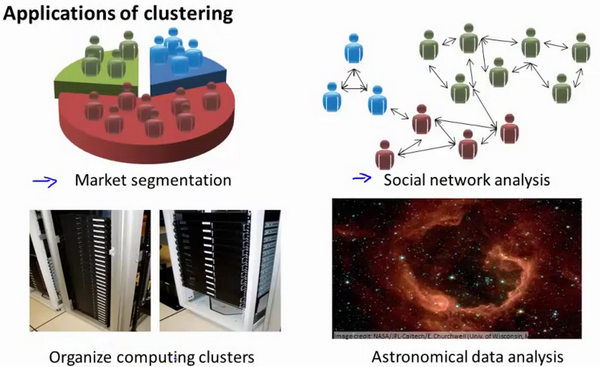

### 13.1 无监督学习：简介

参考视频: 13 - 1 - Unsupervised Learning\_ Introduction (3 min).mkv

在这个视频中，我将开始介绍聚类算法。这将是一个激动人心的时刻，因为这是我们学习的第一个非监督学习算法。我们将要让计算机学习无标签数据，而不是此前的标签数据。

那么，什么是非监督学习呢？在课程的一开始，我曾简单的介绍过非监督学习，然而，我们还是有必要将其与监督学习做一下比较。

在一个典型的监督学习中，我们有一个有标签的训练集，我们的目标是找到能够区分正样本和负样本的决策边界，在这里的监督学习中，我们有一系列标签，我们需要据此拟合一个假设函数。与此不同的是，在非监督学习中，我们的数据没有附带任何标签，我们拿到的数据就是这样的：

在这里我们有一系列点，却没有标签。因此，我们的训练集可以写成只有$x^{(1)}$,$x^{(2)}$…..一直到$x^{(m)}$。我们没有任何标签$y$。因此，图上画的这些点没有标签信息。也就是说，在非监督学习中，我们需要将一系列无标签的训练数据，输入到一个算法中，然后我们告诉这个算法，快去为我们找找这个数据的内在结构给定数据。我们可能需要某种算法帮助我们寻找一种结构。图上的数据看起来可以分成两个分开的点集（称为簇），一个能够找到我圈出的这些点集的算法，就被称为聚类算法。

这将是我们介绍的第一个非监督学习算法。当然，此后我们还将提到其他类型的非监督学习算法，它们可以为我们找到其他类型的结构或者其他的一些模式，而不只是簇。

我们将先介绍聚类算法。此后，我们将陆续介绍其他算法。那么聚类算法一般用来做什么呢？

在这门课程的早些时候，我曾经列举过一些应用：比如市场分割。也许你在数据库中存储了许多客户的信息，而你希望将他们分成不同的客户群，这样你可以对不同类型的客户分别销售产品或者分别提供更适合的服务。社交网络分析：事实上有许多研究人员正在研究这样一些内容，他们关注一群人，关注社交网络，例如**Facebook**，**Google+**，或者是其他的一些信息，比如说：你经常跟哪些人联系，而这些人又经常给哪些人发邮件，由此找到关系密切的人群。因此，这可能需要另一个聚类算法，你希望用它发现社交网络中关系密切的朋友。我有一个朋友正在研究这个问题，他希望使用聚类算法来更好的组织计算机集群，或者更好的管理数据中心。因为如果你知道数据中心中，那些计算机经常协作工作。那么，你可以重新分配资源，重新布局网络。由此优化数据中心，优化数据通信。

最后，我实际上还在研究如何利用聚类算法了解星系的形成。然后用这个知识，了解一些天文学上的细节问题。好的，这就是聚类算法。这将是我们介绍的第一个非监督学习算法。在下一个视频中，我们将开始介绍一个具体的聚类算法。

