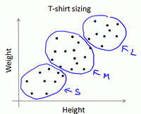

### 13.2 K-均值算法

参考视频: 13 - 2 - K-Means Algorithm (13 min).mkv

**K-均值**是最普及的聚类算法，算法接受一个未标记的数据集，然后将数据聚类成不同的组。

**K-均值**是一个迭代算法，假设我们想要将数据聚类成n个组，其方法为:

首先选择$K$个随机的点，称为**聚类中心**（**cluster centroids**）；

对于数据集中的每一个数据，按照距离$K$个中心点的距离，将其与距离最近的中心点关联起来，与同一个中心点关联的所有点聚成一类。

计算每一个组的平均值，将该组所关联的中心点移动到平均值的位置。

重复步骤2-4直至中心点不再变化。

下面是一个聚类示例：


迭代 1 次


迭代 3 次


迭代 10 次

用$μ^1$,$μ^2$,...,$μ^k$ 来表示聚类中心，用$c^{(1)}$,$c^{(2)}$,...,$c^{(m)}$来存储与第$i$个实例数据最近的聚类中心的索引，**K-均值**算法的伪代码如下：

```
Repeat {

for i = 1 to m

c(i) := index (form 1 to K) of cluster centroid closest to x(i)

for k = 1 to K

μk := average (mean) of points assigned to cluster k

}
```

算法分为两个步骤，第一个**for**循环是赋值步骤，即：对于每一个样例$i$，计算其应该属于的类。第二个**for**循环是聚类中心的移动，即：对于每一个类$K$，重新计算该类的质心。

**K-均值**算法也可以很便利地用于将数据分为许多不同组，即使在没有非常明显区分的组群的情况下也可以。下图所示的数据集包含身高和体重两项特征构成的，利用**K-均值**算法将数据分为三类，用于帮助确定将要生产的T-恤衫的三种尺寸。



