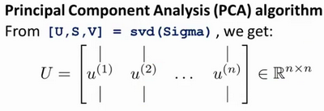

### 14.4 主成分分析算法

参考视频: 14 - 4 - Principal Component Analysis Algorithm (15 min).mkv

**PCA** 减少$n$维到$k$维：

第一步是均值归一化。我们需要计算出所有特征的均值，然后令 $x_j= x_j-μ_j$。如果特征是在不同的数量级上，我们还需要将其除以标准差 $σ^2$。

第二步是计算**协方差矩阵**（**covariance matrix**）$Σ$：
$\sum=\dfrac {1}{m}\sum^{n}_{i=1}\left( x^{(i)}\right) \left( x^{(i)}\right) ^{T}$

第三步是计算协方差矩阵$Σ$的**特征向量**（**eigenvectors**）:

在 **Octave** 里我们可以利用**奇异值分解**（**singular value decomposition**）来求解，`[U, S, V]= svd(sigma)`。

$$Sigma=\dfrac {1}{m}\sum^{n}_{i=1}\left( x^{(i)}\right) \left( x^{(i)}\right) ^{T}$$

对于一个 $n×n$维度的矩阵，上式中的$U$是一个具有与数据之间最小投射误差的方向向量构成的矩阵。如果我们希望将数据从$n$维降至$k$维，我们只需要从$U$中选取前$k$个向量，获得一个$n×k$维度的矩阵，我们用$U_{reduce}$表示，然后通过如下计算获得要求的新特征向量$z^{(i)}$:
$$z^{(i)}=U^{T}_{reduce}*x^{(i)}$$

其中$x$是$n×1$维的，因此结果为$k×1$维度。注，我们不对方差特征进行处理。

