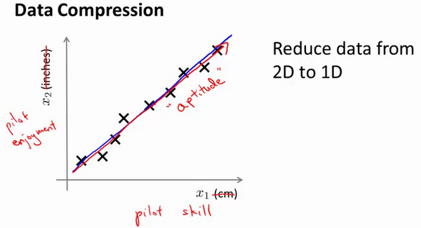

### 14.1 动机一：数据压缩

参考视频: 14 - 1 - Motivation I\_ Data Compression (10 min).mkv

这个视频，我想开始谈论第二种类型的无监督学习问题，称为降维。有几个不同的的原因使你可能想要做降维。一是数据压缩，后面我们会看了一些视频后，数据压缩不仅允许我们压缩数据，因而使用较少的计算机内存或磁盘空间，但它也让我们加快我们的学习算法。

但首先，让我们谈论降维是什么。作为一种生动的例子，我们收集的数据集，有许多，许多特征，我绘制两个在这里。

假设我们未知两个的特征：$x_1$:长度：用厘米表示；$x_2$：是用英寸表示同一物体的长度。

所以，这给了我们高度冗余表示，也许不是两个分开的特征$x_1$和$x_2$，这两个基本的长度度量，也许我们想要做的是减少数据到一维，只有一个数测量这个长度。这个例子似乎有点做作，这里厘米英寸的例子实际上不是那么不切实际的，两者并没有什么不同。

将数据从二维降至一维：
假使我们要采用两种不同的仪器来测量一些东西的尺寸，其中一个仪器测量结果的单位是英寸，另一个仪器测量的结果是厘米，我们希望将测量的结果作为我们机器学习的特征。现在的问题的是，两种仪器对同一个东西测量的结果不完全相等（由于误差、精度等），而将两者都作为特征有些重复，因而，我们希望将这个二维的数据降至一维。

从这件事情我看到的东西发生在工业上的事。如果你有几百个或成千上万的特征，它是它这往往容易失去你需要的特征。有时可能有几个不同的工程团队，也许一个工程队给你二百个特征，第二工程队给你另外三百个的特征，第三工程队给你五百个特征，一千多个特征都在一起，它实际上会变得非常困难，去跟踪你知道的那些特征，你从那些工程队得到的。其实不想有高度冗余的特征一样。

多年我一直在研究直升飞机自动驾驶。诸如此类。如果你想测量——如果你想做，你知道，做一个调查或做这些不同飞行员的测试——你可能有一个特征：$x_1$，这也许是他们的技能（直升机飞行员），也许$x_2$可能是飞行员的爱好。这是表示他们是否喜欢飞行，也许这两个特征将高度相关。你真正关心的可能是这条红线的方向，不同的特征，决定飞行员的能力。

将数据从三维降至二维：
这个例子中我们要将一个三维的特征向量降至一个二维的特征向量。过程是与上面类似的，我们将三维向量投射到一个二维的平面上，强迫使得所有的数据都在同一个平面上，降至二维的特征向量。

这样的处理过程可以被用于把任何维度的数据降到任何想要的维度，例如将1000维的特征降至100维。

正如我们所看到的，最后，这将使我们能够使我们的一些学习算法运行也较晚，但我们会在以后的视频提到它。

