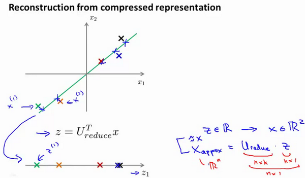

### 14.6 重建的压缩表示

参考视频: 14 - 6 - Reconstruction from Compressed Representation (4 min).mkv

在以前的视频中，我谈论**PCA**作为压缩算法。在那里你可能需要把1000维的数据压缩100维特征，或具有三维数据压缩到一二维表示。所以，如果这是一个压缩算法，应该能回到这个压缩表示，回到你原有的高维数据的一种近似。

所以，给定的$z^{(i)}$，这可能100维，怎么回到你原来的表示$x^{(i)}$，这可能是1000维的数组？

**PCA**算法，我们可能有一个这样的样本。如图中样本$x^{(1)}$,$x^{(2)}$。我们做的是，我们把这些样本投射到图中这个一维平面。然后现在我们需要只使用一个实数，比如$z^{(1)}$，指定这些点的位置后他们被投射到这一个三维曲面。给定一个点$z^{(1)}$，我们怎么能回去这个原始的二维空间呢？$x$为2维，z为1维，$z=U^{T}_{reduce}x$，相反的方程为：$x_{appox}=U_{reduce}\cdot z$,$x_{appox}\approx x$。如图：

如你所知，这是一个漂亮的与原始数据相当相似。所以，这就是你从低维表示$z$回到未压缩的表示。我们得到的数据的一个之间你的原始数据 $x$，我们也把这个过程称为重建原始数据。

当我们认为试图重建从压缩表示 $x$ 的初始值。所以，给定未标记的数据集，您现在知道如何应用**PCA**，你的带高维特征$x$和映射到这的低维表示$z$。这个视频，希望你现在也知道如何采取这些低维表示$z$，映射到备份到一个近似你原有的高维数据。

现在你知道如何实施应用**PCA**，我们将要做的事是谈论一些技术在实际使用**PCA**很好，特别是，在接下来的视频中，我想谈一谈关于如何选择$k$。

