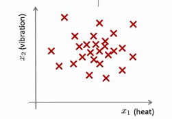

### 15.1 问题的动机

参考文档: 15 - 1 - Problem Motivation (8 min).mkv

在接下来的一系列视频中，我将向大家介绍异常检测(**Anomaly detection**)问题。这是机器学习算法的一个常见应用。这种算法的一个有趣之处在于：它虽然主要用于非监督学习问题，但从某些角度看，它又类似于一些监督学习问题。

什么是异常检测呢？为了解释这个概念，让我举一个例子吧：

假想你是一个飞机引擎制造商，当你生产的飞机引擎从生产线上流出时，你需要进行**QA**(质量控制测试)，而作为这个测试的一部分，你测量了飞机引擎的一些特征变量，比如引擎运转时产生的热量，或者引擎的振动等等。

这样一来，你就有了一个数据集，从$x^{(1)}$到$x^{(m)}$，如果你生产了$m$个引擎的话，你将这些数据绘制成图表，看起来就是这个样子：

这里的每个点、每个叉，都是你的无标签数据。这样，异常检测问题可以定义如下：我们假设后来有一天，你有一个新的飞机引擎从生产线上流出，而你的新飞机引擎有特征变量$x_{test}$。所谓的异常检测问题就是：我们希望知道这个新的飞机引擎是否有某种异常，或者说，我们希望判断这个引擎是否需要进一步测试。因为，如果它看起来像一个正常的引擎，那么我们可以直接将它运送到客户那里，而不需要进一步的测试。

给定数据集 $x^{(1)},x^{(2)},..,x^{(m)}$，我们假使数据集是正常的，我们希望知道新的数据 $x_{test}$ 是不是异常的，即这个测试数据不属于该组数据的几率如何。我们所构建的模型应该能根据该测试数据的位置告诉我们其属于一组数据的可能性 $p(x)$。

上图中，在蓝色圈内的数据属于该组数据的可能性较高，而越是偏远的数据，其属于该组数据的可能性就越低。

这种方法称为密度估计，表达如下：

$$
if \quad p(x)
\begin{cases}
< \varepsilon & anomaly \\
> =\varepsilon & normal
\end{cases}
$$

欺诈检测：

$x^{(i)} = {用户的第i个活动特征}$

模型$p(x)$ 为我们其属于一组数据的可能性，通过$p(x) < \varepsilon$检测非正常用户。

异常检测主要用来识别欺骗。例如在线采集而来的有关用户的数据，一个特征向量中可能会包含如：用户多久登录一次，访问过的页面，在论坛发布的帖子数量，甚至是打字速度等。尝试根据这些特征构建一个模型，可以用这个模型来识别那些不符合该模式的用户。

再一个例子是检测一个数据中心，特征可能包含：内存使用情况，被访问的磁盘数量，**CPU**的负载，网络的通信量等。根据这些特征可以构建一个模型，用来判断某些计算机是不是有可能出错了。

