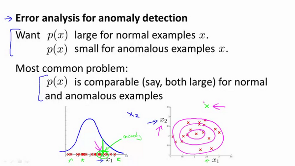

### 15.6 选择特征

参考视频: 15 - 6 - Choosing What Features to Use (12 min).mkv

对于异常检测算法，我们使用的特征是至关重要的，下面谈谈如何选择特征：

异常检测假设特征符合高斯分布，如果数据的分布不是高斯分布，异常检测算法也能够工作，但是最好还是将数据转换成高斯分布，例如使用对数函数：$x= log(x+c)$，其中 $c$ 为非负常数； 或者 $x=x^c$，$c$为 0-1 之间的一个分数，等方法。(编者注：在**python**中，通常用`np.log1p()`函数，$log1p$就是 $log(x+1)$，可以避免出现负数结果，反向函数就是`np.expm1()`)

误差分析：

一个常见的问题是一些异常的数据可能也会有较高的$p(x)$值，因而被算法认为是正常的。这种情况下误差分析能够帮助我们，我们可以分析那些被算法错误预测为正常的数据，观察能否找出一些问题。我们可能能从问题中发现我们需要增加一些新的特征，增加这些新特征后获得的新算法能够帮助我们更好地进行异常检测。

异常检测误差分析：

我们通常可以通过将一些相关的特征进行组合，来获得一些新的更好的特征（异常数据的该特征值异常地大或小），例如，在检测数据中心的计算机状况的例子中，我们可以用**CPU**负载与网络通信量的比例作为一个新的特征，如果该值异常地大，便有可能意味着该服务器是陷入了一些问题中。

在这段视频中，我们介绍了如何选择特征，以及对特征进行一些小小的转换，让数据更像正态分布，然后再把数据输入异常检测算法。同时也介绍了建立特征时，进行的误差分析方法，来捕捉各种异常的可能。希望你通过这些方法，能够了解如何选择好的特征变量，从而帮助你的异常检测算法，捕捉到各种不同的异常情况。

