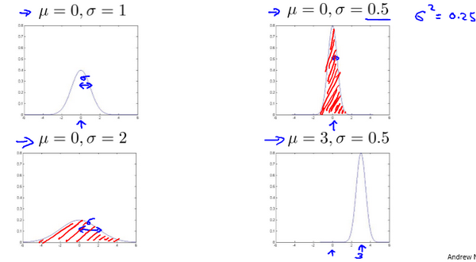

### 15.2 高斯分布

参考视频: 15 - 2 - Gaussian Distribution (10 min).mkv

在这个视频中，我将介绍高斯分布，也称为正态分布。回顾高斯分布的基本知识。

通常如果我们认为变量 $x$ 符合高斯分布 $x \sim N(\mu, \sigma^2)$则其概率密度函数为：
$p(x,\mu,\sigma^2)=\frac{1}{\sqrt{2\pi}\sigma}\exp\left(-\frac{(x-\mu)^2}{2\sigma^2}\right)$
我们可以利用已有的数据来预测总体中的$μ$和$σ^2$的计算方法如下：
$\mu=\frac{1}{m}\sum\limits_{i=1}^{m}x^{(i)}$

$\sigma^2=\frac{1}{m}\sum\limits_{i=1}^{m}(x^{(i)}-\mu)^2$

高斯分布样例：

注：机器学习中对于方差我们通常只除以$m$而非统计学中的$(m-1)$。这里顺便提一下，在实际使用中，到底是选择使用$1/m$还是$1/(m-1)$其实区别很小，只要你有一个还算大的训练集，在机器学习领域大部分人更习惯使用$1/m$这个版本的公式。这两个版本的公式在理论特性和数学特性上稍有不同，但是在实际使用中，他们的区别甚小，几乎可以忽略不计。

