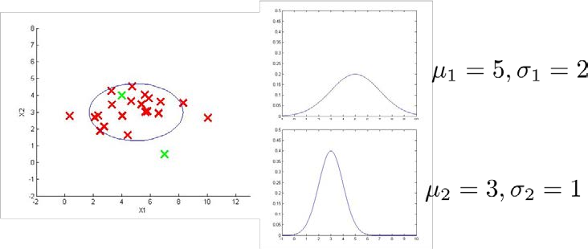

### 15.3 算法 

参考视频: 15 - 3 - Algorithm (12 min).mkv

在本节视频中，我将应用高斯分布开发异常检测算法。

异常检测算法：

对于给定的数据集 $x^{(1)},x^{(2)},...,x^{(m)}$，我们要针对每一个特征计算 $\mu$ 和 $\sigma^2$ 的估计值。

$\mu_j=\frac{1}{m}\sum\limits_{i=1}^{m}x_j^{(i)}$

$\sigma_j^2=\frac{1}{m}\sum\limits_{i=1}^m(x_j^{(i)}-\mu_j)^2$

一旦我们获得了平均值和方差的估计值，给定新的一个训练实例，根据模型计算 $p(x)$：

$p(x)=\prod\limits_{j=1}^np(x_j;\mu_j,\sigma_j^2)=\prod\limits_{j=1}^1\frac{1}{\sqrt{2\pi}\sigma_j}exp(-\frac{(x_j-\mu_j)^2}{2\sigma_j^2})$

当$p(x) < \varepsilon$时，为异常。

下图是一个由两个特征的训练集，以及特征的分布情况：

下面的三维图表表示的是密度估计函数，$z$轴为根据两个特征的值所估计$p(x)$值：

我们选择一个$\varepsilon$，将$p(x) = \varepsilon$作为我们的判定边界，当$p(x) > \varepsilon$时预测数据为正常数据，否则为异常。

在这段视频中，我们介绍了如何拟合$p(x)$，也就是 $x$的概率值，以开发出一种异常检测算法。同时，在这节课中，我们也给出了通过给出的数据集拟合参数，进行参数估计，得到参数 $\mu$ 和 $\sigma$，然后检测新的样本，确定新样本是否是异常。

在接下来的课程中，我们将深入研究这一算法，同时更深入地介绍，怎样让算法工作地更加有效。

